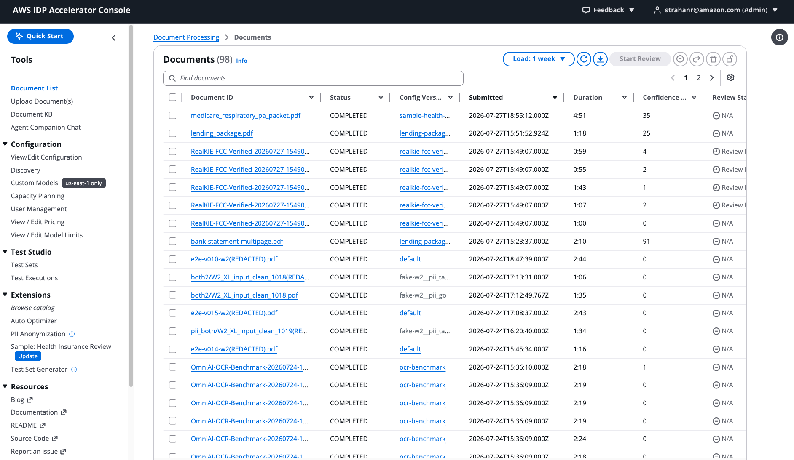

Copyright Amazon.com, Inc. or its affiliates. All Rights Reserved.
SPDX-License-Identifier: MIT-0

# GenAIIDP Web User Interface

The solution includes a responsive web-based user interface built with React that provides comprehensive document management and monitoring capabilities.



_The GenAIIDP Web Interface showing the document tracking dashboard with status information, classification results, and extracted data._

## Features

- Document tracking and monitoring capabilities
- Real-time status updates of document processing
- Secure authentication using Amazon Cognito
- Searchable document history
- Detailed document processing metrics and status information
- Inspection of processing outputs for section classification and information extraction
- Accuracy evaluation reports when baseline data is provided
- View and edit pattern configuration, including document classes, prompt engineering, and model settings
- Manage multiple configuration versions — create, compare, activate, and delete versions (see [configuration-versions.md](configuration-versions.md))
- Retain, view, compare, and delete **document versions** — every processing run of a document is kept and viewable read-only (see [document-versions.md](document-versions.md))
- **Confidence threshold configuration** for HITL (Human-in-the-Loop) triggering through the Assessment & HITL Configuration section
- Document upload from your local computer, or from the **bundled sample documents** shipped with the deployment (no local download needed)
- Knowledge base querying for document collections
- "Chat with document" from the detailed view of the document
- **Document Process Flow visualization** for detailed workflow execution monitoring and troubleshooting
- **Document Analytics** for querying and visualizing processed document data
- **Feedback & issue reporting** — report bugs or request features on GitHub directly from the UI, with your deployment details pre-filled

## Upload Documents

The **Upload Documents** panel accepts documents from two sources, selected with the **Document source** toggle:

- **From my computer** — pick one or more files with the file picker (or drag-and-drop). Files are uploaded directly to the InputBucket via a presigned POST and processed automatically.
- **Sample documents** — choose from the sample documents bundled with the deployment (e.g. a multi-page bank statement, a lending package, a batch of W-2 forms). Selecting a sample copies it server-side into the InputBucket — no local download required. This is the easiest way to try the accelerator or evaluate a configuration preset end-to-end.

In both modes you can set an optional **folder prefix** and pick the **Configuration Version** used to process the document(s).

### One-click config for samples

Many bundled samples are tuned for a specific configuration preset in the [Configuration Library](configuration-versions.md) (for example, the bank-statement sample pairs with the `bank-statement-sample` config). When you select such a sample:

- If the associated configuration is **not yet imported**, a pre-checked **"Also import and use its configuration"** checkbox appears. Leaving it checked imports the preset from the library as a new (non-active) configuration version and processes the sample with it. Uncheck it to process the sample under the currently selected version instead.
- If the associated configuration is **already imported**, that version is preselected automatically.
- Samples with no associated configuration are simply uploaded under the selected version.

The bundled sample documents and their config associations are published to the deployment's ConfigurationBucket at deploy time (under `samples/`, described by `config_library/samples-manifest.json`).

## Edit Sections

The Edit Sections feature provides an intelligent interface for modifying document section classifications and page assignments, with automatic reprocessing optimization for Pattern-2 and Pattern-3 workflows.

### Key Capabilities

- **Section Management**: Create, update, and delete document sections with validation
- **Classification Updates**: Change section document types with real-time validation
- **Page Reassignment**: Move pages between sections with overlap detection
- **Intelligent Reprocessing**: Only modified sections are reprocessed, preserving existing data
- **Immediate Feedback**: Status updates appear instantly in the UI
- **Pattern Compatibility**: Available for Pattern-2 and Pattern-3, with informative guidance for Pattern-1

### How to Use

1. Navigate to a completed document's detail page
2. In the "Document Sections" panel, click the "Edit Sections" button
3. **For Pattern-2/Pattern-3**: Enter edit mode with inline editing capabilities
4. **For Pattern-1**: View informative modal explaining BDA architecture differences

#### Editing Workflow (Pattern-2/Pattern-3)

1. **Edit Section Classifications**: Use dropdowns to change document types
2. **Modify Page Assignments**: Edit comma-separated page IDs (e.g., "1, 2, 3")
3. **Add New Sections**: Click "Add Section" for new document boundaries
4. **Delete Sections**: Use remove buttons to delete unnecessary sections
5. **Validation**: Real-time validation prevents overlapping pages and invalid configurations
6. **Submit Changes**: Click "Save & Process Changes" to trigger selective reprocessing

### Processing Optimization

The Edit Sections feature uses **2-phase schema knowledge optimization**:

#### Phase 1: Frontend

- **Selective Payload**: Only sends sections that actually changed
- **Validation Engine**: Prevents invalid configurations before submission

#### Phase 2: Backend

- **Pipeline**: Processing functions automatically skip redundant operations
  - **OCR**: Skips if pages already have OCR data
  - **Classification**: Skips if pages already classified
  - **Extraction**: Skips if sections have extraction data
  - **Assessment**: Skips if extraction results contain assessment data
- **Selective Reprocessing**: Only modified sections lose their data and get reprocessed

### Pattern Compatibility

#### Pattern-2 and Pattern-3 Support

- **Full Functionality**: Complete edit capabilities with intelligent reprocessing
- **Performance Optimization**: Automatic selective processing for efficiency
- **Data Preservation**: Unmodified sections retain all processing results

#### Pattern-1 Support (Data-Only Edit Mode)

Pattern-1 uses **Bedrock Data Automation (BDA)** with automatic section management. Edit Mode in Pattern-1 provides **data-only editing**:

- **Data Editing**: Edit extraction data (predictions and ground truth) via the "Edit Data" button for each section
- **Section Structure**: Read-only - section boundaries, classifications, and page assignments are managed by BDA
- **Reprocessing**: "Save and Reprocess" triggers evaluation and summarization steps without re-invoking BDA
- **BDA Skip Logic**: When reprocessing with existing pages/sections data, BDA invocation is automatically skipped

**Note**: Pattern-2 and Pattern-3 offer full section structure editing. Pattern-1 maintains BDA-managed section boundaries while allowing extraction data modifications.

## Edit Pages

The Edit Pages feature provides an intelligent interface for modifying individual page classifications and text content, with automatic selective reprocessing for Pattern-2 and Pattern-3 workflows.

### Key Capabilities

- **View Page Text**: Access clean, readable page text without JSON formatting in a modal editor
- **Visual Editor**: The page image is shown on the left (when available) alongside a right-pane toggle between **OCR Lines** and **Markdown**. In OCR Lines, click a line to highlight its bounding box on the image (when the OCR backend provides geometry). Supports mouse-wheel zoom, click-drag pan, and Next/Previous page navigation across the document
- **Markdown view**: Read the page's extracted markdown with a Rendered ↔ Raw toggle; the Raw view is the editable surface in edit mode
- **Classification Reset**: Reset page classifications to force reclassification during reprocessing
- **Text Editing**: Modify page OCR text (via the Raw markdown editor) with immediate S3 saves to prevent data loss
- **Intelligent Reprocessing**: Only affected sections are reprocessed based on modification type
- **Pattern Compatibility**: Available for Pattern-2 and Pattern-3, with informative guidance for Pattern-1

### How to Use

1. Navigate to a completed document's detail page
2. In the "Document Pages" panel, click the "Edit Pages" button
3. **For Pattern-2/Pattern-3**: Enter edit mode with page-level editing capabilities
4. **For Pattern-1**: View informative modal explaining BDA architecture differences

#### Editing Workflow (Pattern-2/Pattern-3)

##### View Mode (Default)
- Click "View Page Text" button to view page content in read-only mode
- The page image is shown on the left, with a right-pane toggle. **OCR Lines** (the default) lists the OCR text lines with per-line confidence; click a text line to draw its bounding box on the image; zoom with the mouse wheel, pan by dragging, and move between pages with the Next/Previous arrows. (Bounding boxes require an OCR backend that provides geometry, e.g. Textract or the Mistral hook; otherwise the lines are shown without overlays.)
- Switch the right pane to **Markdown** to read the page's extracted markdown, with a Rendered ↔ Raw toggle

##### Edit Mode
1. **Click "Edit Pages"**: Activates edit mode for all pages
2. **Reset Page Classification** (optional):
   - Click the  button next to page Class/Type
   - Page becomes "Unclassified" and will be reclassified during reprocessing
3. **Edit Page Text**:
   - Click "Edit Page Text" button to open modal editor
   - Switch the right pane to **Markdown** and choose **Raw (editable)** to edit the page text; use **Rendered** to preview
   - Click "Save" to write changes to S3 immediately
   - Unsaved changes warning prevents data loss
4. **Submit Changes**: Click "Save & Process Changes" to trigger reprocessing
5. **Review Impact**: Confirmation modal shows how many pages will trigger reclassification vs re-extraction
6. **Confirm**: Click "Confirm & Process" to submit document for selective reprocessing

### Processing Optimization

The Edit Pages feature uses intelligent selective reprocessing:

#### Page Classification Reset
- **Impact**: Removes all sections containing the page
- **Triggers**: Full reclassification and re-extraction
- **Use Case**: When page was incorrectly classified

#### Page Text Modification
- **Impact**: Clears extraction results for sections containing the page
- **Preserves**: Sections and classifications remain intact
- **Triggers**: Re-extraction only (skips OCR and classification)
- **Use Case**: Correcting OCR errors to improve extraction accuracy

#### Backend Processing
- **OCR**: Automatically skipped (page text already updated)
- **Classification**: Skipped for text-only modifications, runs for class resets
- **Extraction**: Runs for all affected sections
- **Assessment**: Runs if extraction completes

### Text Format Handling

- **Display**: Plain text extracted from JSON wrapper - no raw JSON visible to users
- **Editing**: User edits plain text in a clean Monaco editor
- **Storage**: Text wrapped back in `{"text": "..."}` format for backward compatibility
- **Confidence**: Markdown table format for readability (Text | Confidence columns)

### Pattern Compatibility

#### Pattern-2 and Pattern-3 Support

- **Full Functionality**: Complete page editing capabilities with intelligent reprocessing
- **Performance Optimization**: Automatic selective processing based on modification type
- **Data Preservation**: Unmodified pages and sections retain all processing results

#### Pattern-1 Information

Pattern-1 uses **Bedrock Data Automation (BDA)** with automatic page management. When Edit Pages is clicked, users see an informative modal explaining:

- **Architecture Differences**: BDA handles page processing automatically
- **Alternative Workflows**: Available options like "View Page Text", Configuration updates, and document reprocessing
- **Future Considerations**: Guidance on using Pattern-2/Pattern-3 for fine-grained page control

## Document Schema Builder

The **Document Schema** tab on the Configuration page provides a visual **Schema Builder** for defining the document types (classes) and fields (attributes) that extraction produces — a JSON Schema Draft 2020-12 editor that requires no hand-editing of JSON. (The same builder powers the **Policy Schema** tab for rule validation.)

### Layout

A three-pane master-detail: the **class list** (left, split into **Document Types** and reusable **Shared Classes**), the **attribute list** for the selected class (middle), and a **property inspector** for the selected class or attribute (right). Document types become top-level schemas; shared classes are referenced from attributes via `$ref` (single object) or `items.$ref` (array/list of that class).

### Key Capabilities

- **Add Class**: create a **Custom Class**, or import a **Standard Class** from 35+ pre-built document types derived from AWS BDA blueprints (fully editable after import).
- **Add Attribute**: add fields to the selected class. The dialog includes an **Add another** button that saves the current field and immediately starts a new one, so multiple attributes can be added without reopening the dialog. A newly-created class with no fields shows an **Add first attribute** button.
- **Show Preview**: opens preview tabs for the schema:
  - **Diagram** — a graphical entity-relationship view. Each class is a node listing its attributes; relationships are drawn as labelled edges (**solid** arrow = a single referenced object, **dashed** arrow = an array/list of that class). Document types are colored and laid out on the left, referenced shared classes to the right by reference depth. Click a node to open that class in the editor.
  - **JSON Schema** — the exported JSON Schema (one per document type, each carrying only the `$defs` it references).
  - **Statistics** — attribute counts and type distribution for the selected class.
- **Export**: download the schema as JSON — **Export all** (every document type) or **Export "&lt;class&gt;"** (the currently-selected document type plus only the shared classes it references).
- **Reorder / edit / remove**: drag attributes to reorder; click any class or attribute to edit its properties, constraints, few-shot examples, and per-class overrides in the inspector.

For the schema format itself and how to author it by hand, see the [JSON Schema Migration Guide](json-schema-migration.md).

## Prompt Preview

The **Prompt Preview** tab in the Configuration page allows you to see exactly what prompts are sent to the LLM for each processing step, with configuration-derived placeholders filled in using your actual class definitions and schemas.

### Key Capabilities

- **Step Selection**: Preview prompts for Classification, Extraction, Assessment, or Summarization
- **Class Selection**: For Extraction and Assessment, select a specific document class to see how its JSON Schema appears in the prompt
- **Filled Placeholders**: Config-derived values (`{CLASS_NAMES_AND_DESCRIPTIONS}`, `{ATTRIBUTE_NAMES_AND_DESCRIPTIONS}`, `{DOCUMENT_CLASS}`) are replaced with actual values from your configuration
- **Runtime Markers**: Document-specific placeholders (`{DOCUMENT_TEXT}`, `{DOCUMENT_IMAGE}`, etc.) are shown as highlighted yellow markers indicating where document content will be inserted at processing time
- **Token Estimates**: Approximate token counts for system and task prompts help with cost awareness
- **Copy to Clipboard**: Copy rendered or raw prompt templates for use in external tools
- **Substitution Details**: See the exact formatted class list or cleaned JSON Schema that gets inserted into the prompt

### How to Use

1. Navigate to the Configuration page
2. Click the **Prompt Preview** tab (alongside Configuration, Document Schema, Rule Schema)
3. Select a **Processing Step** from the dropdown (Classification, Extraction, Assessment, Summarization)
4. For Extraction or Assessment, select a **Document Class** to preview its schema in the prompt
5. View the rendered prompts in the Task Prompt and System Prompt sub-tabs
6. Use the Raw Task Template and Raw System Template sub-tabs to see the unprocessed templates with placeholder syntax

### Use Cases

- **Schema Optimization**: See how your document class attributes appear in the extraction prompt — optimize descriptions and structure for better LLM comprehension
- **Prompt Debugging**: Verify that custom prompt edits render correctly with actual placeholder values
- **Cost Awareness**: Estimate prompt token usage before processing documents
- **Training**: Help new users understand what the LLM actually sees during each processing step

## Document Analytics

The Document Analytics feature allows users to query their processed documents using natural language and receive results in various formats including charts, tables, and text responses.

### Key Capabilities

- **Natural Language Queries**: Ask questions about your processed documents in plain English
- **Multiple Response Types**: Results can be displayed as:
  - Interactive charts and graphs (using Chart.js)
  - Structured data tables with pagination and sorting
  - Text-based responses and summaries
- **Real-time Processing**: Query processing status updates with visual indicators
- **Query History**: Track and review previous analytics queries

### Technical Implementation Notes

The analytics feature uses a combination of real-time subscriptions and polling for status updates:

- **Primary Method**: GraphQL subscriptions via AWS AppSync for immediate notifications when queries complete
- **Fallback Method**: Polling every 5 seconds to ensure status updates are received even if subscriptions fail
- **Current Limitation**: The AppSync subscription currently returns a Boolean completion status rather than full job details, requiring a separate query to fetch results when notified

**TODO**: Implement proper AppSync subscriptions that return complete AnalyticsJob objects to eliminate the need for additional queries and improve real-time user experience.

### How to Use

1. Navigate to the "Document Analytics" section in the web UI
2. Enter your question in natural language (e.g., "How many documents were processed last week?")
3. Click "Submit Query" to start processing
4. Monitor the status indicator as your query is processed
5. View results in the appropriate format (chart, table, or text)
6. Use the debug information toggle to inspect raw response data if needed

## Document Process Flow Visualization

The Document Process Flow feature provides a visual representation of the Step Functions workflow execution for each document:


_The Document Process Flow visualization showing the execution steps, status, and details._

### Key Capabilities

- **Interactive Flow Diagram**: Visual representation of the document processing workflow with color-coded status indicators
- **Step Details**: Detailed information about each processing step including inputs, outputs, and execution time
- **Error Diagnostics**: Clear visualization of failed steps with detailed error messages for troubleshooting
- **Timeline View**: Chronological view of all processing steps with duration information
- **Auto-Refresh**: Option to automatically refresh the flow data for active executions
- **Map State Support**: Visualization of Map state iterations for parallel processing workflows

### How to Use

1. Navigate to a document's detail page
2. Click the "View Processing Flow" button in the document details header
3. The flow diagram will display all steps in the document's processing workflow
4. Click on any step to view its detailed information including:
   - Input/output data
   - Execution duration
   - Error messages (if applicable)
   - Start and completion times
5. For active executions, toggle the auto-refresh option to monitor progress in real-time

### Troubleshooting with Process Flow

The Document Process Flow visualization is particularly useful for troubleshooting processing issues:

- Quickly identify which step in the workflow failed
- View detailed error messages and stack traces
- Understand the sequence of processing steps
- Analyze execution times to identify performance bottlenecks
- Inspect the input and output of each step to verify data transformation

## Download Document Data

The Document Details page exposes a **Download** dropdown in the page header that packages the document's outputs into a single ZIP archive, suitable for sharing, archival, or downstream analysis outside the IDP console.

### Folder layout

The ZIP preserves the **real S3 key structure** under three top-level folders that mirror their source buckets:

- `output/<key>` — files from the **OutputBucket** (section results, page OCR/confidence, page images, summary, evaluation, rule validation)
- `baseline/<key>` — files from the **EvaluationBaselineBucket** (ground-truth section results)
- `input/<key>` — files from the **InputBucket** (the original uploaded source document, optional)

This makes the archive directly comparable to the output of an `aws s3 sync` of the same buckets — users can diff, script against, or re-upload the archive without translating paths.

A self-describing `manifest.json` is written at the ZIP root capturing the export timestamp, scope, document attributes, bucket-to-folder mapping, and the list of files included. If any individual file cannot be fetched (for example, a permissions error), the download continues and the failure is recorded under `errors[]` in the manifest rather than aborting the whole archive.

### Scope options

- **Download All (ZIP)** — every output artifact for the document (summary, evaluation & rule-validation reports, per-section predictions, baselines when available, per-page text, confidence, and consolidated OCR page data). The options dialog offers two checkboxes:
  - **Include page images** (off by default) — includes the rendered page image for each page (can significantly increase archive size).
  - **Include source document** (off by default) — includes the original uploaded file from the **InputBucket** under `input/<key>`.
- **Download Predictions (ZIP)** — only the per-section `sections/<id>/result.json` files (under `output/`) plus the `manifest.json` and `document-attributes.json`.
- **Download Baselines (ZIP)** — only the per-section `sections/<id>/result.json` files from the **EvaluationBaselineBucket** (under `baseline/`). This option is shown only when an evaluation baseline is available.

### Fetching mechanics

Every file in the archive is fetched directly from S3 using a short-lived presigned URL generated client-side with your browser's Cognito credentials, preserving binary content byte-for-byte. A progress modal reports status during the download and offers a **Cancel** button for large documents. The per-section **Download Data** / **Download Baseline** buttons in the Sections panel remain available for single-file downloads.

## Document Versions

The Document Details page includes a **Version History** panel listing every retained processing run of the document, newest first (with the current run badged). Re-uploading a document under the same key — or reprocessing it — no longer discards the prior results; each successful run is kept as an immutable version whose exact output bytes are pinned by S3 object version.

From the panel you can:

- **View** any past version's outputs read-only — its sections, page text/images, extraction results, and summary/evaluation reports are fetched from that run's pinned S3 versions, so you see exactly what that run produced even after later runs overwrote the outputs. Editing is disabled while viewing history; a banner offers **Return to current version**.
- **Compare** any two versions — a section-by-section, field-level diff of their extraction results.
- **Delete** a version (Admin only) — permanently removes that run's pinned object versions; the current version cannot be deleted, and versions still referenced by another retained run are preserved.

See the [Document Versions guide](document-versions.md) for how versioning works, retention, the CLI/API surfaces, and caveats.

## Chat with Document

The "Chat with Document" feature is available at the bottom of the Document Detail view. It provides an interactive Q&A interface grounded in the text of the single document you are viewing — no other documents are considered. The feature is only available after the document's status is **COMPLETE**.

### Model selection

Chat has its own dedicated configuration section (**Configuration tab → "Chat-with-Document Configuration"**) — it is **independent from summarization**. This is important because chat sends the entire document text to the model in a single prompt, so a large-context model (such as `us.anthropic.claude-opus-4-8:1m` — the default — or `us.anthropic.claude-sonnet-4-6:1m`) is usually the best choice, even if you've configured a smaller, cheaper model for summarization.

The Chat panel includes a **Model** selector that defaults to the `chat.model` configured in the version of the config that was used to process the document. You can override the model for the current chat session via the dropdown. The list of selectable models comes from the `chat.model` enum in the configuration schema.

> **OpenAI GPT-5.x in chat:** `openai.gpt-5.4`, `openai.gpt-5.5`, and GPT-5.6 (`openai.gpt-5.6-sol` / `-terra` / `-luna`) are supported for Chat-with-Document and **stream** token-by-token like other models. They run on the `bedrock-mantle` Responses API (US regions only) and are tuned via `chat.reasoning_effort` rather than temperature/top_p. They are hidden from the model selector in EU-region deployments. Note: chat sends the document as **text** (extracted full text), so the PDF-document-block limitation that excludes GPT-5.x from Discovery does not apply here. See [OpenAI GPT-5.x Models](./openai-models.md).

If a document is "too large for chat context window" — i.e. Bedrock returns an `Input Tokens Exceeded` error — pick a larger-context model in the Chat panel's Model selector and retry. For documents that are larger than any single-prompt model can fit, use the [Knowledge Base](./knowledge-base.md) feature instead.

### Chat history

Your chat history is preserved while you remain on the Document Detail screen; leaving and returning erases it. Prompt caching is used for the document contents across successive turns on the same document to reduce latency and cost.

### Streaming & live status

Chat-with-Document runs as an asynchronous workflow so it can use long-latency large-context models without hitting an AppSync synchronous-request timeout. When you submit a prompt:

1. A **status pill** appears above the input area and transitions as the backend makes progress: **Queued → Loading document text → Querying {model} → Streaming response**.
2. As soon as the model starts producing output, the assistant bubble appears with a blinking cursor and **tokens stream in** live (throttled to ~200 ms / 200-char batches server-side so the UI stays responsive under heavy throttling).
3. When generation completes the status pill clears and the bubble finalizes with a timestamp and the model ID used.
4. Errors (including RBAC scope denials on documents outside your `allowedConfigVersions`) render inline in the assistant bubble in red so you can see what went wrong without losing the context of the conversation.

The session is scoped to your user — other users cannot subscribe to or continue your chat session even if they know the session ID.

See the feature in action in this video:

https://github.com/user-attachments/assets/50607084-96d6-4833-85a6-3dc0e72b28ac

### How to Use

1. Navigate to a document's detail page and scroll to the bottom
2. In the text area, type in your question and you'll see an answer pop up after the document is analyzed with the Nova Pro model

## Feedback & Issue Reporting

The UI makes it easy to report bugs or request enhancements on the project's public
GitHub repository, with your deployment details pre-filled so you don't have to
hand-type them. There are three entry points:

- **Feedback menu (top navigation).** A **Feedback** menu is available in the top
  navigation bar to every user, with **Report a bug**, **Request a feature**, and
  **View existing issues**. Bug/feature links open a pre-filled GitHub issue form in
  a new tab.
- **Report this issue on GitHub (Troubleshoot modal).** After running the
  [Error Analyzer](error-analyzer.md) on a failed document, the Troubleshoot modal
  footer offers **Report this issue on GitHub** — it pre-fills the bug form with the
  document context (object key, status, config version, execution ARN, and the
  agent's findings) in addition to the environment details. A **Copy full details**
  button copies the complete environment + findings text to your clipboard for
  pasting anything the URL can't carry (long transcripts are length-capped in the
  link). The modal only closes via its **Close** button (clicking outside or pressing
  Esc no longer dismisses it, so a running analysis isn't interrupted), and a
  **Minimize** button collapses it to a small restore chip while the analysis
  continues in the background.
- **Create GitHub issue (Agent Companion Chat).** The [Agent Companion Chat](agent-companion-chat.md)
  — which can also run the Error Analyzer — shows a **Create GitHub issue** button
  under the latest agent answer, offering *Report a bug* (with the answer attached as
  findings) or *Request a feature*.
- **Resources & help panel.** The side navigation **Resources** section includes a
  **Report an issue** link, and the right-side info (Help) panel on the Document List
  includes a **Feedback & support** section with the same links.

**What gets pre-filled.** Every link opens the GitHub new-issue page with the
**issue body** pre-populated — an environment summary (**Version**, **Build**,
**Stack name**, **Region**, **Processing Mode**) sourced from the deployment's
settings, plus context: the Troubleshoot path adds the document context and agent
findings, and the Agent Companion Chat path adds the agent's answer. The report/copy
affordances appear once the agent job completes.

> **Privacy note:** issues on the public repository are visible to everyone. Nothing
> is submitted automatically — GitHub always shows you the pre-filled form to review
> first. **Please review every field and redact any sensitive document data**
> (names, account numbers, PII) before submitting.

The in-app links pre-fill the issue **body** directly (via `?title=&body=&labels=`),
so the content is embedded immediately. This intentionally bypasses the `.yml` issue
*forms* in `.github/ISSUE_TEMPLATE/` — GitHub ignores a pre-filled `body` when a form
template is selected — so those forms apply only when a user clicks **New issue**
directly on GitHub. Very long findings are length-capped in the URL; use **Copy full
details** in the Troubleshoot modal to grab the complete text.

## Authentication Features

The web UI uses Amazon Cognito for secure user authentication and authorization:

### User Management

- Admin users can be created during stack deployment
- Optional self-service sign-up with email domain restrictions
- Automatic email verification
- Password policies and account recovery

### Security Controls

- Multi-factor authentication (MFA) support
- Temporary credentials and automatic token refresh
- Role-based access control using Cognito user groups
- Secure session management

## Deploying the Web UI

The web UI is automatically deployed as part of the CloudFormation stack. The deployment:

1. Creates required Cognito resources (User Pool, Identity Pool)
2. Builds and deploys the React application to S3
3. Sets up CloudFront distribution for content delivery (or API Gateway for VPC-based hosting — see [API Gateway Hosting](./apigateway-hosting.md))
4. Configures necessary IAM roles and permissions

## Accessing the Web UI

Once the stack is deployed:

1. Navigate to the `ApplicationWebURL` provided in the stack outputs
2. For first-time access:
   - Use the admin email address specified during stack deployment
   - Check your email for temporary credentials
   - You will be prompted to change your password on first login

## Running the UI Locally

To run the web UI locally for development:

1. Navigate to the `/ui` directory
2. Create a `.env` file using the `WebUITestEnvFile` output from the CloudFormation stack:

```
VITE_USER_POOL_ID=<value>
VITE_USER_POOL_CLIENT_ID=<value>
VITE_IDENTITY_POOL_ID=<value>
VITE_APPSYNC_GRAPHQL_URL=<value>
VITE_AWS_REGION=<value>
VITE_SETTINGS_PARAMETER=<value>
```

3. Install dependencies: `npm install`
4. Start the development server: `npm run start`
5. Open [http://localhost:3000](http://localhost:3000) in your browser

## Configuration Options

The following parameters are configured during stack deployment:

- `AdminEmail`: Email address for the admin user
- `AllowedSignUpEmailDomain`: Optional comma-separated list of allowed email domains for self-service signup

### Parameters baked into the UI at build time

Some CloudFormation parameters are read by the UI as build-time constants
(`import.meta.env.VITE_*`), which Vite substitutes into the JavaScript bundle
when CodeBuild runs `npm run build`. Changing one of these therefore requires the
UI to be rebuilt before it takes effect in the browser:

| Parameter | Affects |
|-----------|---------|
| `AllowedSignUpEmailDomain` | Whether the login page offers the **Sign Up** tab |
| `ExternalIdPType` / `ExternalIdPName` | The federated "Sign in with …" button and Amplify's OAuth configuration |
| `ExternalIdPAutoLogin` | Automatic redirect to the external IdP |
| `EnableQuickStartWidget` | The Quick Start widget |
| `WebUIHosting` | The SPA's asset base path (`/` vs `/api/`) and the OAuth redirect origin |
| `CustomDomainUrl` | The OAuth redirect origin |

Changing any of these on an existing stack triggers the UI rebuild
automatically, so no manual step is needed. (Before v0.6.3 it did not — see the
note below.) Everything else the UI shows is resolved at runtime and takes
effect on the next page load without a rebuild.

If a UI-affecting parameter change ever appears not to have taken effect, you
can rebuild manually:

```bash
STACK=<your-stack-name>
aws codebuild start-build --project-name ${STACK}-webui-build
# After the build succeeds, invalidate the CDN cache (CloudFront hosting only):
DIST=$(aws cloudformation describe-stack-resources --stack-name "$STACK" \
  --logical-resource-id CloudFrontDistribution \
  --query 'StackResources[0].PhysicalResourceId' --output text)
aws cloudfront create-invalidation --distribution-id "$DIST" --paths '/*'
```

Then hard-reload the page.

> **Note for stacks updated before v0.6.3:** changing one of these parameters on
> an existing stack used to leave the previously-built bundle in place, so the
> change silently had no effect in the UI. Most visibly, adding
> `AllowedSignUpEmailDomain` correctly enabled self-service signup in Cognito
> while the login page went on hiding the **Sign Up** tab. No manual step is
> needed to recover: upgrading to a new release changes the UI source location,
> which rebuilds the bundle with your current parameter values. The manual
> rebuild above is only needed if you want to fix it without upgrading.

## Security Considerations

The web UI implementation includes several security features:

- All communication is encrypted using HTTPS
- Authentication tokens are automatically rotated
- Session timeouts are enforced
- CloudFront distribution uses secure configuration (or API Gateway with AWS-managed TLS for VPC-based hosting)
- S3 buckets are configured with appropriate security policies
- API access is controlled through IAM and Cognito
- Web Application Firewall (WAF) protection for AppSync API

### Web Application Firewall (WAF)

The solution includes AWS WAF integration to protect your AppSync API:

- **IP-based access control**: Restrict API access to specific IP ranges
- **Default behavior**: By default (`0.0.0.0/0`), WAF is disabled and all IPs are allowed
- **Configuration**: Use the `WAFAllowedIPv4Ranges` parameter to specify allowed IP ranges
  - Example: `"192.168.1.0/24,10.0.0.0/16"` (comma-separated list of CIDR blocks)
- **Security benefit**: When properly configured, WAF blocks all traffic except from your trusted IP ranges and AWS Lambda service IP ranges
- **Lambda service access**: The solution automatically maintains a WAF IPSet with current AWS Lambda service IP ranges to ensure Lambda functions can always access the AppSync API even when IP restrictions are enabled

When configuring the WAF:

- IP ranges must be in valid CIDR notation (e.g., `192.168.1.0/24`)
- Multiple ranges should be comma-separated
- The WAF is only enabled when the parameter is set to something other than the default `0.0.0.0/0`
- Lambda functions within your account will automatically have access to the AppSync API regardless of IP restrictions

## Monitoring and Troubleshooting

The web UI includes built-in monitoring:

- CloudWatch metrics for API and authentication activity
- Access logs in CloudWatch Logs
- CloudFront distribution logs (or API Gateway access logs for VPC-based hosting)
- Error tracking and reporting
- Performance monitoring

To troubleshoot issues:

1. Check CloudWatch Logs for application errors
2. Verify Cognito user status in the AWS Console
3. Check CloudFront distribution status (or API Gateway stage / execute-api endpoint health for VPC-based hosting)
4. Verify API endpoints are accessible
5. Review browser console for client-side errors