# Data Flows

## Document Information

| Field | Value |
|-------|-------|
| **Document Version** | 3.0 |
| **Last Updated** | 2026-07-28 |
| **Applies to release** | v0.6.3 |
| **Classification** | Internal |

> **v3.0 update.** All UI flows were rewritten: AppSync GraphQL + subscriptions
> are replaced by the API Gateway REST dispatcher (`POST /op/{field}`) with
> polling for status, and a Lambda Function URL for chat streaming. The A2I
> human-review flow is replaced by the built-in review portal. New flows added
> for the preprocessing/PII hook, the Feature Platform UI bundle, and the
> Jobs API.

## 1. Overview

This document describes the primary data flows through the GenAI IDP Accelerator, identifying where data crosses trust boundaries, undergoes transformation, and is persisted. Each flow is analyzed for security-relevant characteristics.

## 2. Document Processing Flow (Core Pipeline)

### 2.1 Document Ingestion

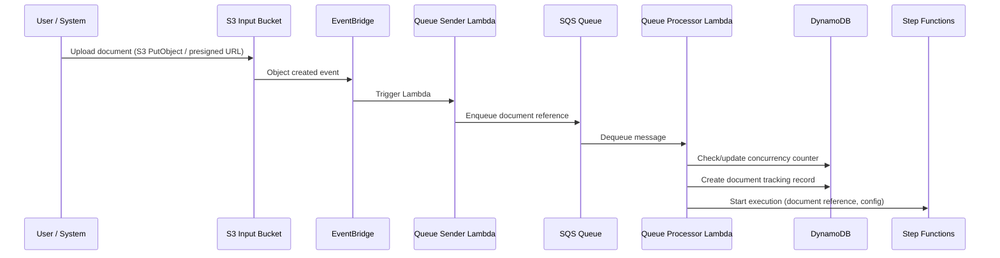

**Data in transit**: Document bytes (S3 upload), S3 object key references (SQS messages), configuration JSON (Step Functions input).

**Trust boundary crossings**:
- TB1→TB2: User uploads document over HTTPS
- TB3 internal: S3 → EventBridge → Lambda → SQS → Lambda → Step Functions

**Security controls**:
- S3 bucket policy restricts upload access
- SQS encryption at rest (SSE-SQS)
- Step Functions input validated by Queue Processor Lambda
- DynamoDB concurrency counter prevents runaway processing

### 2.1a Preprocessing Hook (runs first, both modes)

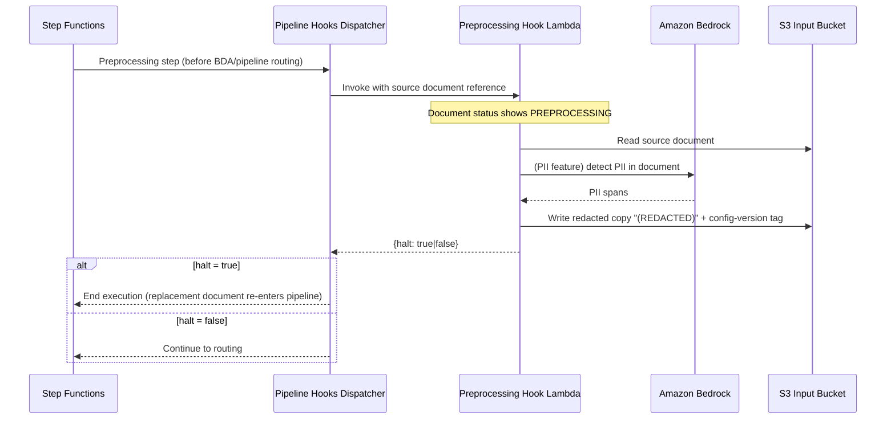

**Security-relevant characteristics**:
- The hook runs **before** any classification/extraction model sees the document, which is the point of the PII feature — but the **detection call itself sends the un-redacted document to Bedrock** (TB3→TB4). This is an accepted, documented residual exposure (see PII.T01).
- Writing the redacted copy back to the *input* bucket creates a re-entrancy risk; a marker + guard prevents redaction loops (PII.T02).
- `onError: fail` is terminal — a failed hook stops the execution rather than falling through to processing the un-redacted original (a fail-**closed** design; see PII.T03).

**Trust boundary crossings**: TB3→TB6 (hook is customer/feature-managed), TB3→TB4 (PII detection call).

### 2.2 Pipeline Mode Processing

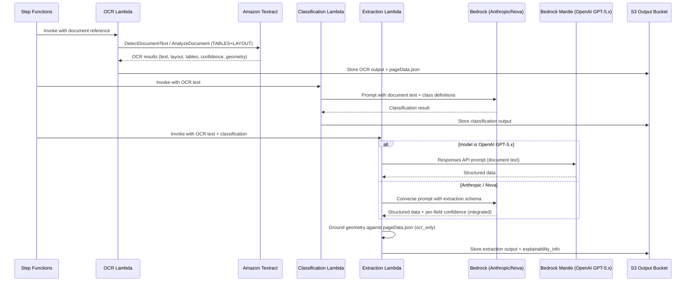

**Data transformation**: Raw document → OCR text/layout → classified document type → structured JSON extraction with per-field confidence and bounding boxes.

> **v0.6 change.** Confidence and bounding-box geometry are now **outputs of
> extraction** (`confidence.mode: integrated`), not a separate Assessment
> stage; the standalone Assessment step auto-skips. The former `Assess`
> participant is retained only for `confidence.mode: separate`.

**Sensitive data exposure**: Full document text is sent to Textract and to the configured model endpoint. Where the configured model is an OpenAI GPT-5.x variant, that text goes to the `bedrock-mantle` OpenAI Responses API — a **different model family within TB4** than the Anthropic/Nova default. Deployments with data-residency or model-vendor constraints must account for this (see PM.T08). Extracted PII/sensitive data flows through Lambda memory and is written to S3.

**Trust boundary crossings**:
- TB3→TB4: Lambda sends document text to Textract and Bedrock (Anthropic/Nova **or** OpenAI via mantle)

### 2.3 BDA Mode Processing

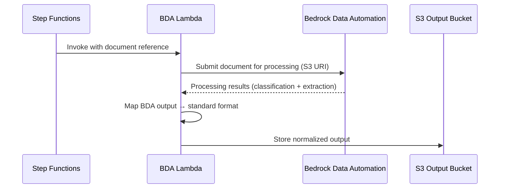

**Data transformation**: Raw document → BDA-processed results → normalized to standard pipeline output format.

**Trust boundary crossings**:
- TB3→TB4: Lambda provides S3 URI to BDA service; BDA reads document directly from S3

### 2.4 Shared Processing Tail

```mermaid
sequenceDiagram
    participant SFN as Step Functions
    participant HITL as HITL Check Lambda
    participant DDB as DynamoDB
    participant Reviewer as Reviewer (Web UI portal)
    participant RV as Rule Validation Lambda
    participant Bedrock as Amazon Bedrock
    participant PRVHook as Post-Rule-Validation Hook
    participant Sum as Summarization Lambda
    participant Eval as Evaluation Lambda
    participant S3 as S3 Output Bucket
    participant Report as Reporting Lambda

    SFN->>HITL: Check if any section is below confidence threshold
    alt HITL Enabled and threshold breached
        HITL->>DDB: Mark sections PENDING_REVIEW; end execution
        Note over Reviewer: Decoupled — review happens out-of-band
        Reviewer->>DDB: Claim section, save corrections (completeSectionReview)
        Reviewer->>SFN: Final section resolved -> trigger_reprocessing
    end

    SFN->>RV: Validate extracted data against rules
    RV->>Bedrock: Optional AI-assisted rule evaluation
    RV-->>SFN: Validation results
    SFN->>PRVHook: Dispatch postRuleValidation hook (incl. skip paths)

    SFN->>Sum: Generate document summary
    Sum->>Bedrock: Summarization prompt
    Sum-->>SFN: Summary text

    SFN->>Eval: Compare results to ground truth (if available)
    Eval->>S3: Store evaluation report

    SFN->>Report: Save metering/reporting data
    Report->>S3: Write Parquet file to reporting bucket
    Report->>DDB: Update document record; snapshot immutable run version
```

> **v0.6 change — HITL no longer uses Amazon A2I or SageMaker.** Human review
> is a **built-in portal in the Web UI**, backed by the REST API and DynamoDB
> section-review tracking. There is no A2I `FlowDefinition`, no SageMaker
> workteam, and no external review portal URL. Review is **decoupled** from the
> workflow: per-section actions update tracking directly, and resolving the last
> pending section triggers downstream reprocessing. Authorization for review
> actions is the Admin/Reviewer group set enforced in the resolver Lambdas
> (`completeSectionReview`, `skipSectionReview`), not an A2I task assignment.

### 2.5 Document Version Snapshot

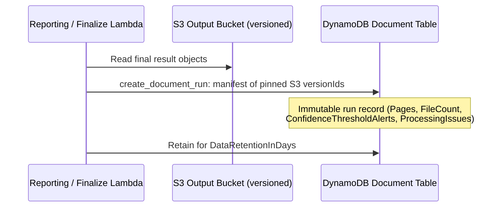

**Security-relevant characteristics**: Re-processing no longer overwrites prior
results — each run is retained as an immutable snapshot addressed by pinned S3
object versions. This **increases data retention surface**: deleted-then-
reprocessed content remains readable through version history until retention
expires. `deleteDocumentVersion` is Admin-only; `listDocumentVersions` is
readable by any authenticated user. Version bytes are fetched via
`getFilePresignedUrl` with an explicit `versionId` — see UI.T02/UI.T06 for the
key-scoping gap that applies to those reads.

## 3. Web UI Data Flows

### 3.1 Authentication + API Request Flow

```mermaid
sequenceDiagram
    participant Browser as Browser
    participant Host as CloudFront OR API Gateway S3 proxy
    participant Cognito as Cognito User Pool
    participant WAF as WAFv2 (optional)
    participant APIGW as API Gateway REST
    participant Disp as HTTP API Dispatcher Lambda
    participant Resolver as Resolver Lambda

    Browser->>Host: Load SPA (React app)
    Host-->>Browser: Static assets from S3 UI bucket
    Browser->>Cognito: Authenticate (username/password or SSO)
    Cognito-->>Browser: JWT tokens (ID, Access, Refresh)

    Browser->>WAF: POST /op/{field} + Bearer JWT
    WAF->>APIGW: (allow-listed IP only; default Block)
    APIGW->>APIGW: Cognito authorizer: AUTHENTICATE only (401 if invalid)
    APIGW->>Disp: Normalized event {field, arguments, identity}
    Disp->>Disp: Validate arguments vs schema-derived spec (400 on bad shape)
    Disp->>Resolver: Invoke mapped resolver
    Resolver->>Resolver: Check cognito:groups -> PermissionError = 403
    Resolver->>Resolver: Check allowedConfigVersions scope -> in-band 200 deny
    Resolver-->>Browser: Result
```

**Critical control note**: the Cognito authorizer performs **no group
evaluation** — it only proves the token is valid. Every group and scope decision
lives in the resolver Lambda. A resolver that omits its check ships an
operation that *looks* protected in `schema.graphql` but is open to any
authenticated user (AUTH.T08). This is why the automated authorization harness
(`make api-test` / `make api-test-static`) is a **primary** control rather than
a nice-to-have.

**Trust boundary crossings**: TB1→TB2 (browser to CloudFront/Cognito), TB2→TB3 (JWT to API Gateway → dispatcher → resolvers).

### 3.2 Status Update Flow (polling — replaces subscriptions)

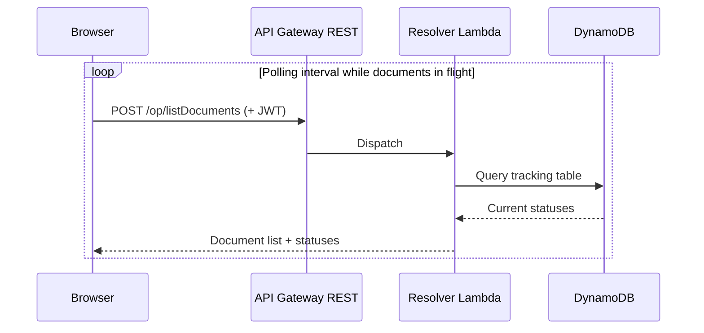

**Security note**: AppSync real-time subscriptions are gone. Status freshness is
now bounded by the poll interval, and each poll is a fully re-authorized
request — removing the class of threat where a long-lived subscription outlives
the authorization decision that established it. The trade-off is request volume;
throttling is handled by API Gateway stage limits and Lambda concurrency.

### 3.3 Configuration Management Flow

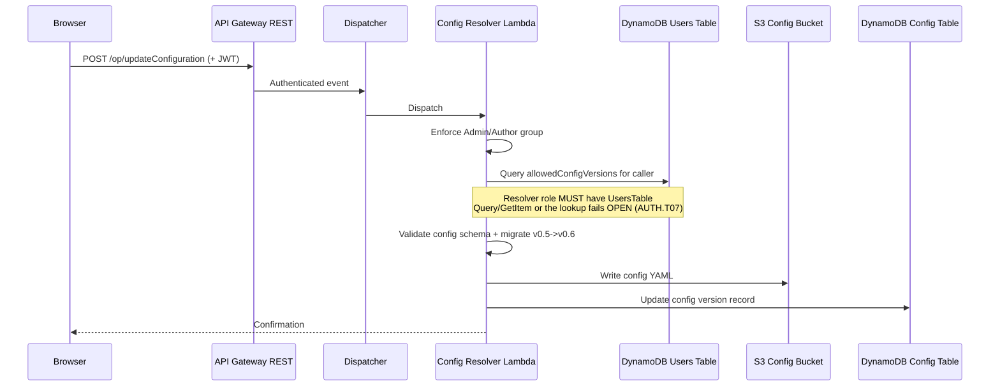

**Security note**: Configuration includes model IDs, prompts, extraction schemas, and processing parameters. Malicious configuration could influence all subsequent document processing (PM.T06). The config-version scope lookup previously failed **open** on an IAM gap — fixed in v0.6.0 and now regression-gated (AUTH.T07).

### 3.4 Document Upload Flow (UI)

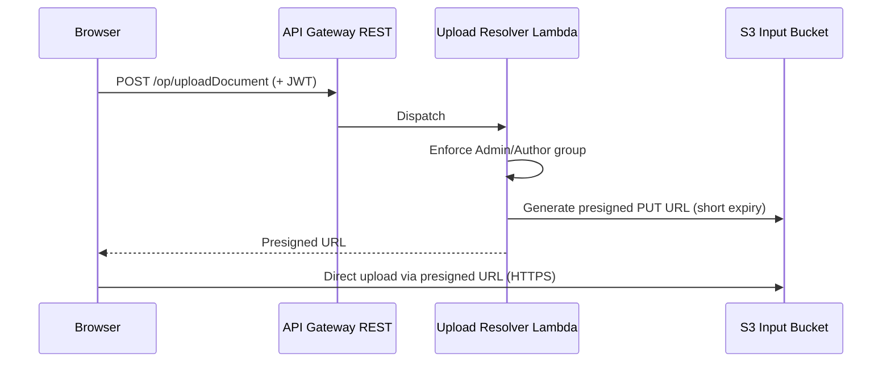

### 3.5 Web UI Hosting Modes

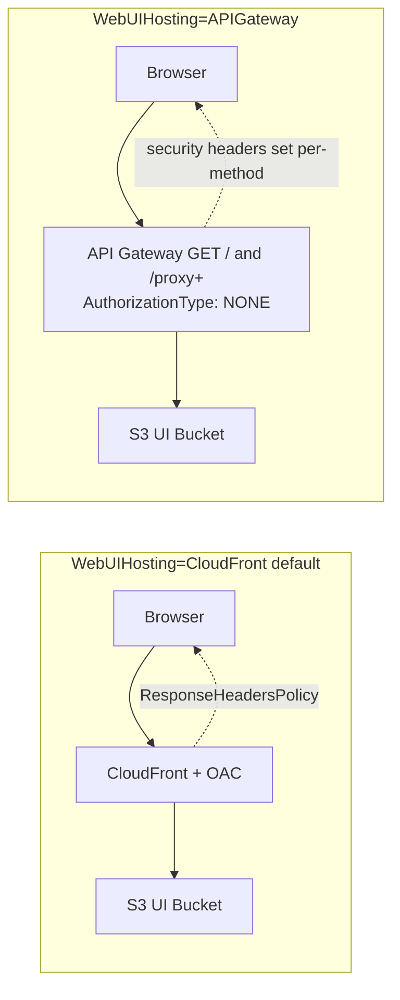

**Security note**: In `APIGateway` hosting mode there is **no CloudFront**, so
the CloudFront `ResponseHeadersPolicy` does not apply; the SPA document and
asset responses set `X-Content-Type-Options`, `Strict-Transport-Security`,
`X-Frame-Options`, and `Referrer-Policy` per-method instead. The two SPA GET
routes are `AuthorizationType: NONE` (the SPA shell and hashed assets are not
secrets; auth happens inside the app against `/op`), but the PRIVATE endpoint
policy and the optional WAF WebACL still gate them. **No CSP is emitted in this
mode** — see UI.T01.

## 4. Agent & Chat Data Flows

### 4.1 Companion Chat Flow

There are **two transports** for chat, and they differ in their authorization
properties. This matters: the streaming transport is a separate internet-facing
endpoint that does not traverse the REST dispatcher.

**(a) Streaming transport — Lambda Function URL (the UI's default path)**

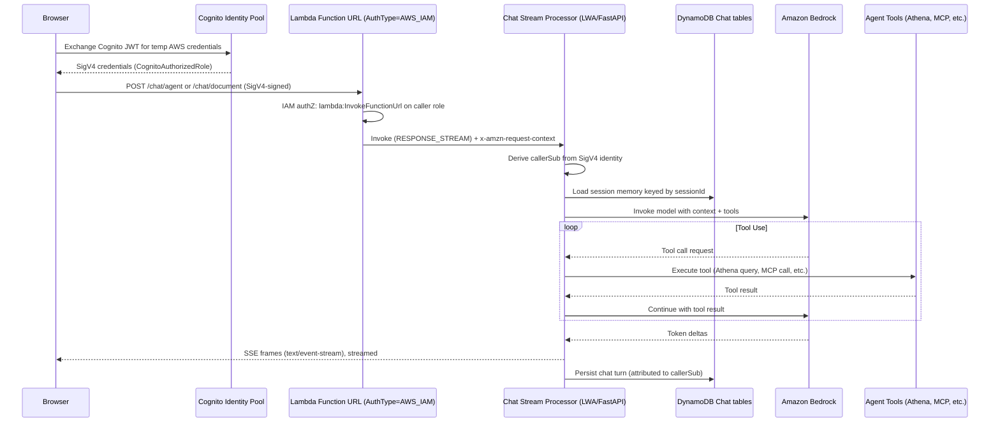

**Security-relevant characteristics of the streaming transport**:

| Property | Status |
|---|---|
| Network exposure | Public Function URL (no CloudFront/WAF/VPC in front) |
| Authentication | SigV4 via `AuthType=AWS_IAM` — unauthenticated callers rejected by Lambda |
| Authorization granularity | **Only** `lambda:InvokeFunctionUrl` on the shared `CognitoAuthorizedRole` — the role is common to **all four RBAC groups**, so the IAM gate cannot distinguish Admin from Reviewer |
| Group (RBAC) enforcement | **None on this path.** The Admin/Author/Viewer restriction on `sendAgentChatMessage` is enforced in the *resolver*, not here |
| Session ownership | **Not enforced.** Neither streaming processor performs the `ownerSub`-vs-caller check the resolver path does |
| CORS | `AllowOrigins: "*"`, `AllowCredentials: false` (safe: SigV4 in headers, no cookies) |
| Covered by `make api-test` | **No** — the harness drives `POST /op/{field}` only |

See CHAT.T03 (streaming-path authorization gaps) and CHAT.T06 (caller-identity
trust inconsistency) for the full analysis.

**(b) Non-streaming transport — REST resolver (fallback; GovCloud without streaming)**

```mermaid
sequenceDiagram
    participant Browser as Browser
    participant APIGW as API Gateway REST
    participant Resolver as agent_chat / send_chat_document resolver
    participant DDB as DynamoDB Chat tables
    participant Proc as Chat Processor Lambda

    Browser->>APIGW: POST /op/sendAgentChatMessage (+ JWT)
    APIGW->>Resolver: Dispatch
    Resolver->>Resolver: Enforce group (Admin/Author/Viewer)
    Resolver->>DDB: Claim/verify session ownerSub == caller sub
    Note over Resolver: Mismatch -> "Unauthorized: session belongs to another user"
    Resolver->>Proc: Invoke processor (persistUserMessage=false)
    Resolver-->>Browser: Ack; UI polls for the final answer
```

**Trust boundary crossings**:
- TB1→TB3: User message via the Function URL (SigV4) **or** the REST API (JWT)
- TB3→TB4: Conversation context sent to Bedrock
- TB3→TB5: Analytics queries to Athena
- TB3→TB6: MCP tool calls to customer-managed agents

### 4.2 Agent Analysis Flow

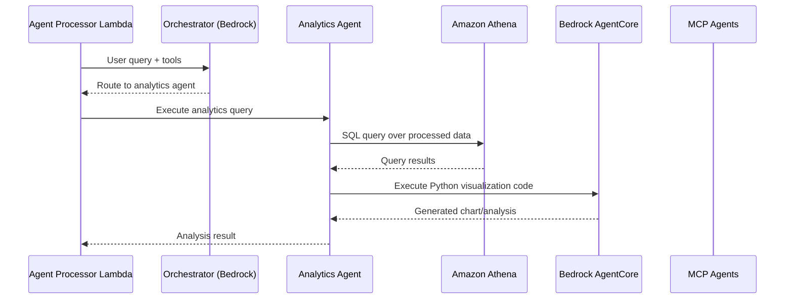

**Security note**: Natural language → SQL translation creates SQL injection risk. AgentCore code execution is sandboxed but executes AI-generated code.

### 4.3 MCP Integration Flow

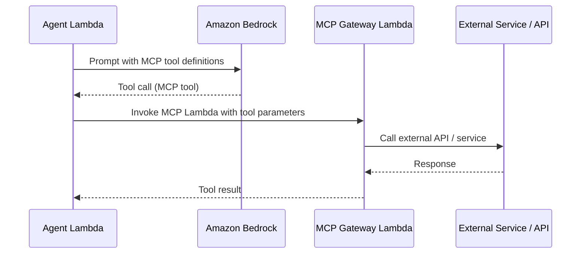

**Trust boundary crossings**: TB3→TB6→External. MCP agents can call external services, introducing data exfiltration and injection risks.

## 5. SDK/CLI Data Flow

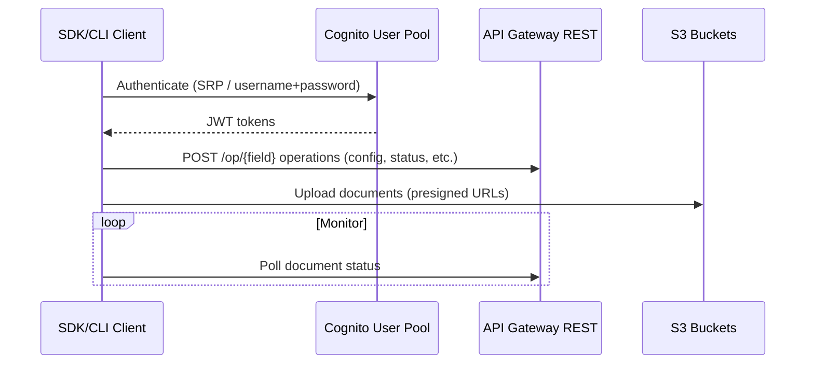

**Security note**: SDK/CLI stores credentials locally on developer machines. Tokens are short-lived but refresh tokens provide extended access. The CLI is subject to exactly the same resolver-side group/scope checks as the browser — there is no privileged CLI bypass.

### 5.1 Jobs API Flow (machine-to-machine, `EnableJobsApi=true`)

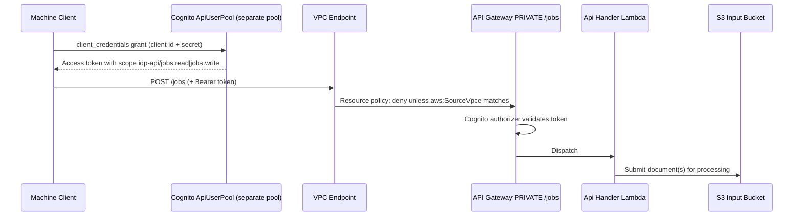

**Security-relevant characteristics**:
- Uses a **separate Cognito user pool** (`ApiUserPool`) from the Web UI pool — so Jobs API clients are *not* subject to the 4-group RBAC model at all. Authorization is by OAuth **scope** (`jobs.read` / `jobs.write`), not Cognito group.
- The client has a **static secret** (`GenerateSecret: true`); there are no per-document or per-config-version restrictions on what a `jobs.write` client may submit.
- Endpoint is `PRIVATE` with a resource policy denying any request whose `aws:SourceVpce` doesn't match the supplied endpoint — so exposure is VPC-scoped, not internet-scoped.
- **Not covered** by `make api-test` (which targets the UI `/op` route).

See [JOB.T01–T03](../feature-threats/jobs-api.md).

### 5.2 Feature Platform / Extension Install + Load Flow

```mermaid
sequenceDiagram
    participant Admin as Admin
    participant CFN as CloudFormation
    participant FeatStack as Feature Stack (own template)
    participant Deployer as Feature ui-deployer
    participant WebUIB as S3 Web UI Bucket
    participant Host as Host SPA (browser)
    participant APIGW as API Gateway REST

    Admin->>CFN: Deploy feature stack (out-of-band, console/CLI)
    CFN->>FeatStack: Create feature resources + register feature
    FeatStack->>Deployer: Run ui-deployer
    Deployer->>WebUIB: Write features/<id>/v<ver>/ui-bundle.js (Cache-Control 300)
    Note over Deployer,WebUIB: Scoped write: only its own prefix

    Host->>APIGW: POST /op/listInstalledFeatures (any authenticated user)
    APIGW-->>Host: Feature registry incl. uiBundlePath
    Host->>Host: createElement('script') src=/<path>/ui-bundle.js
    WebUIB-->>Host: Bundle bytes (SAME ORIGIN as host SPA)
    Host->>Host: Bundle calls IdpFeatures.register(); gets React,<br/>Cloudscape, amplify, IdpFeatureHost.generateClient
    Host->>APIGW: Feature-initiated API calls using the USER'S session
```

**Trust boundary crossings**: TB6→TB1. This is the sharpest boundary crossing
added since v2.0: the feature's JavaScript executes **in the host SPA's origin**,
inside the authenticated user's session, with a host-provided API client. It is
**not** sandboxed (no iframe, no CSP isolation — and the CloudFront CSP permits
`unsafe-inline`/`unsafe-eval`). Installing a feature grants it the effective
privilege of every user who loads the UI. Install is Admin-gated and the
ui-deployer's S3 write is prefix-scoped, but there is **no integrity check**
(no SRI hash, no signature) on the bundle at load time.

See [FEAT.T01–T04](../feature-threats/feature-platform.md).

## 6. Reporting & Analytics Data Flow

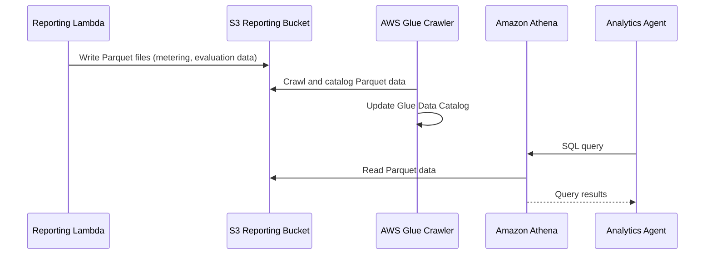

## 7. Knowledge Base Data Flow

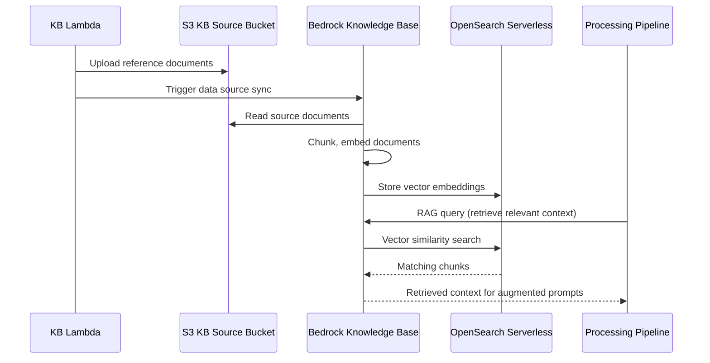

## 8. Lambda Hook Data Flows

### 8.1 Inference Hook

```mermaid
sequenceDiagram
    participant SFN as Step Functions
    participant Hook as Customer Lambda Hook
    participant ExtModel as External Model / API

    SFN->>Hook: Invoke with document data + context
    Hook->>ExtModel: Custom inference call
    ExtModel-->>Hook: Model results
    Hook-->>SFN: Results in expected format
```

### 8.2 Post-Processing Hook

```mermaid
sequenceDiagram
    participant SFN as Step Functions
    participant Decomp as Decompressor Lambda
    participant Hook as Customer Lambda Hook
    participant ExtSys as External System

    SFN->>Decomp: Invoke with compressed results
    Decomp->>Decomp: Decompress document data
    Decomp->>Hook: Invoke with full document results
    Hook->>ExtSys: Push results to external system
    Hook-->>Decomp: Acknowledgment
```

**Trust boundary crossings**: TB3→TB6. Customer-managed Lambda hooks receive full document processing results and can send data to arbitrary external systems.

## 9. Summary of Cross-Boundary Data Flows

| Flow | From | To | Data Sensitivity | Controls |
|------|------|----|-----------------|----------|
| Document upload | TB1 | TB3 | High (customer docs) | HTTPS, presigned URLs, Admin/Author group |
| OCR processing | TB3 | TB4 | High (full document text) | TLS, IAM roles |
| LLM prompts (Anthropic/Nova) | TB3 | TB4 | High (document text + PII) | TLS, IAM roles, no training opt-out |
| **LLM prompts (OpenAI GPT-5.x via mantle)** | TB3 | TB4 | High (document text + PII) | TLS, IAM roles; **different model family — verify vendor/residency constraints** (PM.T08) |
| **UI API operations** | TB1 | TB3 | High | JWT authn at gateway; **group/scope authz in resolver Lambdas only**; input-shape validation; optional WAF |
| **Chat streaming (SSE)** | TB1 | TB3→TB4 | Medium-High | **SigV4 on a public Function URL; no group check, no session-ownership check** (CHAT.T03) |
| Chat messages (REST path) | TB1 | TB3→TB4 | Medium-High | Group check + `ownerSub` ownership check |
| **Jobs API submission** | TB1 | TB3 | High | Separate Cognito pool, OAuth scopes, PRIVATE endpoint + VPCe resource policy (JOB.T01) |
| **Feature UI bundle** | TB6 | TB1 | High (runs as the user) | Admin-gated install, prefix-scoped S3 write; **no SRI/signature, same-origin, unsandboxed** (FEAT.T01) |
| **Preprocessing / PII hook** | TB3 | TB6→TB4 | High (un-redacted document) | Fail-closed `onError: fail`; re-entrancy guard; detection call still sees raw PII (PII.T01) |
| MCP tool calls | TB3 | TB6→External | Variable (depends on tool) | IAM, customer responsibility |
| Lambda hooks | TB3 | TB6 | High (full processing results) | IAM, invocation-only permissions |
| Analytics queries | TB3 | TB5 | High (aggregated processing data) | Athena workgroup, IAM |
| KB retrieval | TB3 | TB4→TB5 | Medium (reference doc chunks) | IAM, encryption |
| SDK/CLI auth | TB1 | TB2 | High (credentials) | SRP protocol, short-lived tokens |
| Configuration | TB1 | TB3 | Medium (prompts, schemas) | Auth, schema validation, config-version scope |
| **Presigned object reads** | TB3 | TB1 | High (any object in stack buckets) | Bucket allow-list only — **no key-level scoping** (UI.T06) |
| **Test-set ground truth writes** | TB1 | TB3 | Medium (evaluation baselines) | Admin/Author group; `_editHistory` provenance (RPT.T07) |
