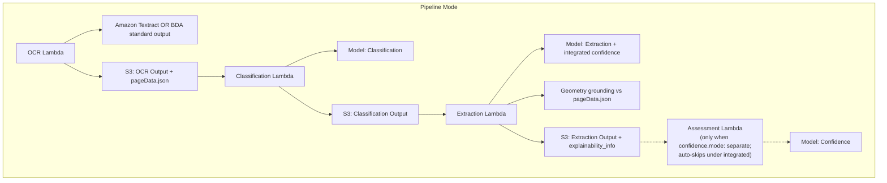

# Pipeline Mode Threat Analysis

## Document Information

| Field | Value |
|-------|-------|
| **Document Version** | 3.0 |
| **Last Updated** | 2026-07-28 |
| **Applies to release** | v0.6.3 |
| **Classification** | Internal |
| **Processing Mode** | Pipeline (`use_bda: false`) |

> **v3.0 update.** Confidence and bounding-box geometry are now **outputs of
> extraction** (`confidence.mode: integrated`), not a separate Assessment stage —
> the standalone Assessment step auto-skips, and granular assessment is retired.
> OCR may be backed by Textract **or** BDA-as-OCR (`ocr.backend: bda`). Models
> may be Anthropic, Nova, **or OpenAI GPT-5.x** via `bedrock-mantle` — see the
> new **PM.T08**.

## 1. Overview

Pipeline mode is the default processing mode. It uses Amazon Textract (or BDA-as-OCR) for OCR and Amazon Bedrock foundation models (Claude, Nova, or OpenAI GPT-5.x) for classification and extraction — with per-field confidence and geometry produced inside extraction — plus summarization. This mode provides maximum configurability with separate prompts and model selection for each processing stage.

## 2. Architecture Components

### 2.1 Processing Steps

| Step | Lambda | AWS Service | Input | Output |
|------|--------|-------------|-------|--------|
| **OCR** | OCR Lambda | Amazon Textract (`TABLES`+`LAYOUT` by default) **or** Bedrock Data Automation standard output | S3 document URI | Text, layout, tables, word-level confidence + geometry |
| **Classification** | Classification Lambda | Bedrock (Claude/Nova) or `bedrock-mantle` (GPT-5.x) | OCR text + class definitions | Document type + confidence |
| **Extraction** | Extraction Lambda | Bedrock (Claude/Nova) or `bedrock-mantle` (GPT-5.x) | OCR text + extraction schema | Structured JSON + **per-field confidence + bounding boxes** |
| **Assessment** *(conditional)* | Assessment Lambda | Bedrock (Claude/Nova) | Extracted data | Per-field confidence — **only** under `confidence.mode: separate` |

> **Sharded extraction.** Advanced (agentic) extraction shards large documents
> across a Step Functions **Distributed Map**; each shard persists idempotently
> to S3, and confidence assessment + geometry grounding run **inside** each
> shard before a merge step reconciles row counts. Shard/batch sizes are derived
> from the model's context/output window minus `extraction.context_buffer`.
> Relevant to PM.T04 (cross-step poisoning) since shard outputs are
> intermediate S3 state.

### 2.2 Configurable Elements

Each step is independently configurable via the YAML configuration:
- **Model selection**: Different models per step, including **cross-vendor** choices (Anthropic / Nova / OpenAI GPT-5.x) — see PM.T08
- **Custom prompts**: Full control over system and user prompts
- **Extraction schemas**: JSON Schema-based field definitions with types, descriptions, validation rules
- **Classification definitions**: Document type names, descriptions, few-shot examples
- **Confidence & geometry**: `confidence.mode` (`integrated`/`separate`/`off`), `geometry.mode` (`ocr_only` default, `llm`, `llm_grounded`), thresholds and per-field alerts
- **Few-shot examples**: S3-stored example documents for improved accuracy
- **Reasoning effort**: `reasoning_effort` for effort-capable models (extraction defaults to `low`)

## 3. Pipeline-Specific Threats

### PM.T01: Prompt Injection via Document Content

| Attribute | Value |
|-----------|-------|
| **Threat ID** | PM.T01 |
| **Category** | STRIDE: Tampering, Elevation of Privilege |
| **Description** | Adversarial content embedded in documents (text, metadata, hidden layers) could manipulate Bedrock model behavior during classification, extraction, or assessment |
| **Attack Vector** | Upload document containing prompt injection payloads in visible or hidden text |
| **Impact** | Misclassification, incorrect extraction, bypassed assessment criteria, data exfiltration via model output |
| **Likelihood** | High |
| **Severity** | High |
| **Affected Components** | Classification Lambda, Extraction Lambda, Assessment Lambda |
| **Mitigations** | Input sanitization, prompt engineering with guardrails, output validation, Bedrock Guardrails configuration, assessment step as verification layer |

### PM.T02: OCR Manipulation / Adversarial Documents

| Attribute | Value |
|-----------|-------|
| **Threat ID** | PM.T02 |
| **Category** | STRIDE: Tampering |
| **Description** | Specially crafted documents designed to produce incorrect OCR output from Textract, leading to downstream processing errors |
| **Attack Vector** | Documents with adversarial fonts, overlapping text, steganographic content, or layout manipulation |
| **Impact** | Incorrect text extraction leading to misclassification, wrong data extraction, failed validation |
| **Likelihood** | Medium |
| **Severity** | Medium |
| **Affected Components** | OCR Lambda, Amazon Textract |
| **Mitigations** | Document format validation, image quality checks, confidence score thresholds, multi-pass OCR comparison |

### PM.T03: Model Output Manipulation

| Attribute | Value |
|-----------|-------|
| **Threat ID** | PM.T03 |
| **Category** | STRIDE: Tampering, Information Disclosure |
| **Description** | Bedrock model responses could contain unexpected content, hallucinated data, or leak information from training data |
| **Attack Vector** | Crafted prompts or document content that causes model to generate unexpected outputs |
| **Impact** | Incorrect business decisions based on hallucinated data, false confidence scores |
| **Likelihood** | Medium |
| **Severity** | High |
| **Affected Components** | Classification Lambda, Extraction Lambda, Assessment Lambda |
| **Mitigations** | Output schema validation (JSON Schema), confidence thresholds, evaluation against ground truth, human review for high-value documents |

### PM.T04: Cross-Step Data Poisoning

| Attribute | Value |
|-----------|-------|
| **Threat ID** | PM.T04 |
| **Category** | STRIDE: Tampering |
| **Description** | Compromised output from one pipeline step could poison subsequent steps. For example, incorrect OCR output could cause the extraction step to produce malicious structured data |
| **Attack Vector** | Exploit S3 intermediate storage or Lambda compromise to modify inter-step data |
| **Impact** | Cascading errors through entire pipeline, corrupted final output |
| **Likelihood** | Low |
| **Severity** | High |
| **Affected Components** | S3 intermediate outputs, all pipeline Lambdas |
| **Mitigations** | S3 versioning, server-side encryption, IAM role separation per Lambda, Step Functions state validation |

### PM.T05: Textract Service Dependency

| Attribute | Value |
|-----------|-------|
| **Threat ID** | PM.T05 |
| **Category** | STRIDE: Denial of Service |
| **Description** | Amazon Textract service throttling or outage impacts all document processing in Pipeline mode |
| **Attack Vector** | Volume-based attacks exceeding Textract API limits, or AWS service disruption |
| **Impact** | Complete processing pipeline stoppage |
| **Likelihood** | Medium |
| **Severity** | Medium |
| **Affected Components** | OCR Lambda, Amazon Textract |
| **Mitigations** | Retry logic with exponential backoff, SQS dead letter queue, CloudWatch alarms on Textract errors, capacity planning with service quotas |

### PM.T06: Configuration Tampering

| Attribute | Value |
|-----------|-------|
| **Threat ID** | PM.T06 |
| **Category** | STRIDE: Tampering, Elevation of Privilege |
| **Description** | Malicious modification of pipeline configuration (prompts, schemas, model IDs) could alter processing behavior for all subsequent documents |
| **Attack Vector** | Compromised admin account modifies configuration via UI or API |
| **Impact** | All documents processed with malicious prompts, data extraction to attacker-controlled schemas, use of unauthorized models |
| **Likelihood** | Medium |
| **Severity** | Critical |
| **Affected Components** | Configuration S3 bucket, DynamoDB config table, configuration resolver Lambdas (REST API) |
| **Mitigations** | RBAC (only Admin/Author can modify config), configuration versioning, JSON Schema validation, audit logging, configuration change alerts |

### PM.T07: Few-Shot Example Poisoning

| Attribute | Value |
|-----------|-------|
| **Threat ID** | PM.T07 |
| **Category** | STRIDE: Tampering |
| **Description** | Malicious few-shot examples uploaded to S3 could systematically bias classification and extraction behavior |
| **Attack Vector** | Upload poisoned example documents that cause model to misclassify or misextract targeted document types |
| **Impact** | Systematic misprocessing of specific document types |
| **Likelihood** | Low |
| **Severity** | Medium |
| **Affected Components** | Few-shot examples S3 storage, Classification Lambda, Extraction Lambda |
| **Mitigations** | RBAC on example management (Admin/Author only), example validation, evaluation framework to detect accuracy degradation |

### PM.T08: Document Content Sent to a Non-Anthropic Model Family (OpenAI via `bedrock-mantle`)

| Attribute | Value |
|-----------|-------|
| **Threat ID** | PM.T08 |
| **Category** | STRIDE: Information Disclosure |
| **Description** | Since v0.6.1 the configured model for OCR, classification, extraction, assessment, summarization, evaluation, and Chat-with-Document may be an **OpenAI GPT-5.x** variant (`openai.gpt-5.6-sol` / `-terra` / `-luna`, plus GPT-5.4/5.5) served on the `bedrock-mantle` OpenAI Responses API. Full document text — including any PII the pipeline has not redacted — is then sent to a **different model family** than the Anthropic/Nova default that earlier versions of this threat model assumed. Deployments operating under a vendor-approval list, a model-provider restriction, or a data-residency policy may be out of compliance without any configuration change appearing security-relevant: selecting a model is an ordinary config edit made by an Admin/Author in the UI. |
| **Attack Vector** | Not primarily adversarial: an Author selects a GPT-5.x model from the config dropdown for cost or quality reasons, unaware of a vendor/residency constraint. Adversarially, a config-tampering attacker (PM.T06) could switch the model to change where document content egresses. |
| **Impact** | Document content and PII processed by a model family the deployment may not have approved; potential compliance/residency violation. Region exposure also changes: GPT-5.6 is **US-only** (Sol in `us-east-1`/`us-east-2`; Terra/Luna add `us-west-2`), with no EU/global profiles and **no GovCloud** — so selecting one in an EU-oriented deployment moves inference to US regions. |
| **Likelihood** | Medium (a normal config action) |
| **Severity** | Medium |
| **Affected Components** | `idp_common/bedrock/openai_responses.py`, model config enums, config UI model dropdowns, pricing/limits tables |
| **Mitigations** | All traffic stays **within Amazon Bedrock in the customer's own account** — this is a Bedrock-served model, not a call out to OpenAI's own API, so it does not leave the AWS trust boundary (TB4) and is covered by the same TLS/IAM controls and no-training posture. Model selection requires the **Admin/Author** group and is config-versioned and audit-logged, so a change is attributable and reversible (PM.T06 controls apply). Bedrock model access must be explicitly requested/enabled per model in the account, giving a second account-level gate outside the application. Region availability is enforced by Bedrock itself — an unavailable model fails loudly rather than silently rerouting. GovCloud deployments **cannot** select GPT-5.6 at all. Agentic extraction, Discovery, and Policy Discovery reject these models at `config-validate` and at runtime. |
| **Residual risk / recommendation** | The application does not implement an allow-list restricting *which* Bedrock models a deployment may select — any model in the enum is choosable by an Author. Deployments with vendor constraints should (1) restrict model access at the **Bedrock account level** (the effective control), and (2) treat the model fields in a config version as security-relevant in change review. Consider a stack parameter constraining the selectable model set for regulated deployments. |

## 4. Pipeline Mode Security Controls Summary

| Control | Implementation | Threats Mitigated |
|---------|---------------|-------------------|
| **Input validation** | Document format/size checks, Lambda input validation | PM.T01, PM.T02 |
| **Output validation** | JSON Schema validation of model outputs; off-schema field filtering | PM.T03, PM.T04 |
| **Prompt engineering** | Guardrails in system prompts, input/output tags | PM.T01 |
| **Bedrock Guardrails** | Optional content filtering and topic denial | PM.T01, PM.T03 |
| **Encryption** | S3 SSE, TLS in transit | PM.T04 |
| **IAM least privilege** | Separate execution roles per Lambda | PM.T04, PM.T06 |
| **RBAC** | Cognito groups controlling config access | PM.T06, PM.T07, PM.T08 |
| **Bedrock account-level model access** | Per-model access must be enabled in the account — the effective gate on model family | PM.T08 |
| **Config versioning + audit** | Model changes are versioned, attributable, reversible | PM.T06, PM.T08 |
| **Pre-inference redaction (optional)** | PII Anonymization preprocessing hook removes PII before models see it | PM.T04, PM.T08 |
| **Retry/DLQ** | SQS DLQ, Step Functions retry policies | PM.T05 |
| **Evaluation** | Ground truth comparison for accuracy monitoring | PM.T03, PM.T07 |
| **Audit logging** | CloudWatch Logs, CloudTrail | PM.T06 |
