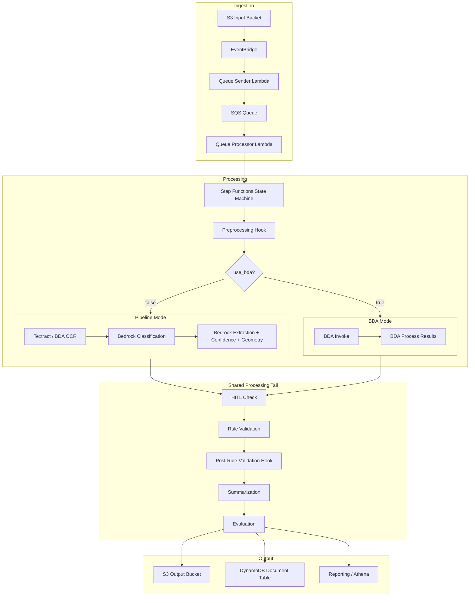
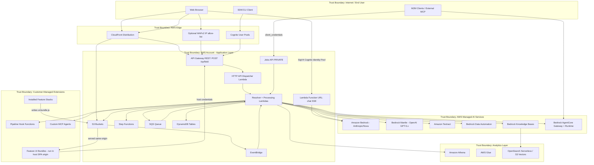

# System Overview

## Document Information

| Field | Value |
|-------|-------|
| **Document Version** | 3.0 |
| **Last Updated** | 2026-07-28 |
| **Applies to release** | v0.6.3 |
| **Classification** | Internal |
| **System Name** | GenAI Intelligent Document Processing (IDP) Accelerator |

> **v3.0 architecture update.** This document was rewritten for the v0.6 line.
> Material changes from v2.0: **AWS AppSync is fully removed** (replaced by an
> API Gateway REST API + polling + a Lambda Function URL for chat streaming);
> **ALB Web UI hosting is removed** (replaced by API Gateway S3-proxy hosting);
> **Amazon A2I / SageMaker HITL is removed** (replaced by a built-in review
> portal in the Web UI); and the **Feature Platform**, **Jobs API**, and
> **preprocessing hook** are new trust-boundary-crossing surfaces.

## 1. System Purpose

The GenAI IDP Accelerator is an AWS-deployed intelligent document processing solution that automates the extraction, classification, and analysis of information from documents using generative AI. It provides a configurable, serverless pipeline that processes documents through multiple stages—preprocessing, OCR, classification, extraction (with integrated confidence and bounding-box geometry), rule validation, summarization, and evaluation—with optional human-in-the-loop (HITL) review.

## 2. Unified Architecture

The system uses a **unified deployment model** with two processing modes selectable at runtime via the `use_bda` configuration flag:

- **Pipeline Mode** (`use_bda: false`, default): Uses Amazon Textract (or BDA-as-OCR) for OCR and Amazon Bedrock foundation models (Claude, Nova, OpenAI GPT-5.x via `bedrock-mantle`) for classification, extraction, and confidence.
- **BDA Mode** (`use_bda: true`): Uses Amazon Bedrock Data Automation (BDA) as an integrated service for document processing, with results mapped back into the standard pipeline output format.

Both modes share common infrastructure for document ingestion, preprocessing, queueing, tracking, human review, rule validation, evaluation, reporting, and the web UI.

> **Note on the preprocessing hook.** `preprocessing` runs *first*, before the
> BDA/pipeline routing, so it fires in both modes and even when OCR is
> disabled. It operates on the source document itself and may return
> `halt: true` to end the execution. This is the extension point the bundled
> **PII Anonymization** feature consumes. See HOOK.T06 and PII.T01–T03.

## 3. Key Components

### 3.1 Infrastructure Layer

| Component | Service | Purpose |
|-----------|---------|---------|
| **Input/Output Storage** | Amazon S3 (13 buckets) | Document upload, processing output, configuration, reporting, test sets, evaluation baseline, Web UI assets |
| **Document Queue** | Amazon SQS (16 queues incl. DLQs) | Decouples ingestion from processing; manages throughput |
| **Event Routing** | Amazon EventBridge | S3 events → Lambda, Step Functions status tracking |
| **Workflow Orchestration** | AWS Step Functions (4 state machines) | Multi-step document processing, agentic shard Distributed Map |
| **Document Tracking** | Amazon DynamoDB (12 tables) | Documents, Configuration, Users, Metering, ChatSessions, ChatMessages, Agents, TestSets, etc. |
| **UI API Layer** | **Amazon API Gateway REST** (`POST /op/{field}`) | Single Cognito-authorized route + dispatcher to resolver Lambdas |
| **Chat Streaming** | **AWS Lambda Function URL** (`AuthType=AWS_IAM`, `RESPONSE_STREAM`) | SSE token-delta streaming for the two chat flows |
| **Jobs API** (optional) | Amazon API Gateway REST (PRIVATE) | `EnableJobsApi=true`: `/jobs` endpoints for machine-to-machine batch submission |
| **Edge / WAF** | CloudFront, optional WAFv2 (REGIONAL) | SPA delivery; optional IP allow-list WebACL on the REST API stage |
| **Authentication** | Amazon Cognito (2 user pools) | Main user pool (4 RBAC groups) + separate M2M pool for the Jobs API |
| **Compute** | AWS Lambda (115+ functions) | Processing logic, API resolvers, agents, hooks |
| **Monitoring** | Amazon CloudWatch | Alarms, dashboards, KMS-encrypted log groups |

### 3.2 AI/ML Services

| Service | Usage |
|---------|-------|
| **Amazon Bedrock** | Foundation models (Claude 3.x–5, Nova) for classification, extraction, confidence, summarization, agent chat |
| **Amazon Bedrock (`bedrock-mantle`)** | OpenAI GPT-5.x (Sol/Terra/Luna) via the OpenAI Responses API — a **non-Anthropic model family** reachable with document content (see PM.T08) |
| **Amazon Bedrock Data Automation (BDA)** | Whole-pipeline processing (`use_bda`) **or** OCR-only engine (`ocr.backend: bda`) |
| **Amazon Textract** | OCR (DetectDocumentText, AnalyzeDocument incl. `TABLES`/`LAYOUT`) |
| **Amazon Bedrock Knowledge Bases** | RAG retrieval over OpenSearch Serverless or S3 Vectors |
| **Amazon Bedrock AgentCore** | MCP Gateway (external tool access) and AgentCore Runtime (e.g. Test Set Generator) |
| **Amazon Athena / Glue** | SQL analytics over processed document data |

### 3.3 Application Features

| Feature | Description | Key Services |
|---------|-------------|--------------|
| **Web UI** | React/Cloudscape SPA for configuration, monitoring, review | CloudFront **or** API Gateway S3 proxy, S3, REST API, Cognito |
| **Agent Analysis** | Multi-agent AI for interactive document analysis | Bedrock, Athena, AgentCore |
| **Companion Chat** | Multi-turn conversational AI with SSE streaming | **Lambda Function URL**, Bedrock, DynamoDB |
| **MCP Integration** | External tool execution via Model Context Protocol | AgentCore Gateway, Lambda, Cognito M2M client |
| **RBAC** | 4-tier role-based access control + config-version scope | Cognito Groups, resolver Lambdas |
| **Human Review (HITL)** | **Built-in review portal in the Web UI** (no A2I/SageMaker) | REST API, DynamoDB, S3 |
| **Discovery** | AI-driven configuration generation from sample documents | Bedrock, Lambda, multi-doc-discovery ECR container |
| **SDK/CLI** | Programmatic access for automation and integration | Python packages, Cognito auth |
| **Knowledge Base** | RAG integration for context-enhanced processing | Bedrock KB, OpenSearch Serverless / S3 Vectors |
| **Pipeline Hooks** | `preprocessing` + per-step `postHook` extensibility | Lambda, customer-managed code |
| **Feature Platform / Extensions** | Installable extensions that inject **UI bundles into the host SPA origin** and register their own APIs | S3 (WebUIBucket), CloudFormation, Lambda |
| **PII Anonymization** | Bundled preprocessing extension that redacts PII pre-inference | Bedrock, S3, DynamoDB (mapping table) |
| **Document Versions** | Immutable per-run snapshots with pinned S3 object versions | S3 versioning, DynamoDB |
| **Test Studio** | Test sets, document browser, **ground-truth visual editor** | REST API, Lambda, S3 (TestSetBucket) |
| **Test Set Generator** | Synthetic labeled test-set generation | AgentCore Runtime, Bedrock |
| **Reporting** | Analytics database with Athena, Glue, Parquet | S3, Glue, Athena |
| **Rule Validation** | Configurable business rule checks on extracted data | Lambda, Bedrock |
| **Evaluation** | Automated accuracy measurement against ground truth | Lambda, S3 |
| **Quick Start** | Conversational config bootstrap agent | Bedrock, AgentCore |

## 4. Trust Boundaries

### Trust Boundary Descriptions

| Boundary | Description | Controls |
|----------|-------------|----------|
| **TB1: Internet/End User** | Untrusted external users and clients | TLS 1.2+, authentication required |
| **TB2: AWS Edge** | CDN, identity, optional WAF | CloudFront OAC, Cognito JWT validation, optional WAFv2 IP allow-list (default-block WebACL) |
| **TB3: Application Layer** | Core application infrastructure | IAM roles, least-privilege Lambda execution roles, **all group/scope authorization enforced in resolver Lambdas**, VPC-optional (`ApiGatewayVisibility=PRIVATE`) |
| **TB4: Managed AI Services** | AWS-managed AI/ML services | Service-linked roles, encryption in transit/at rest; note GPT-5.x is a non-Anthropic model family on Bedrock |
| **TB5: Analytics Layer** | Data analytics and search | Athena workgroup isolation, OpenSearch encryption |
| **TB6: Customer Extensions** | Customer/third-party hooks, MCP agents, and **installed features** | Separate IAM roles, invocation-only permissions from core. **Feature UI bundles execute in the host SPA's origin with the user's session** — see FEAT.T01 |

> **Critical boundary note (new in v3.0).** TB6 now contains code that executes
> *inside* TB1's browser context at the host's origin: an installed feature's
> `ui-bundle.js` is injected via `document.createElement('script')` and is
> handed a host API client. Unlike a hook Lambda (which is isolated by IAM),
> a feature UI bundle is **not** isolated from the host session. Installing a
> feature is therefore equivalent to granting it the privileges of every user
> who visits the UI. See [FEAT.T01](../feature-threats/feature-platform.md).

## 5. Authorization Model (v0.6)

The authorization trust boundary sits **entirely in the resolver Lambdas**:

| Layer | What it does | What it does NOT do |
|-------|--------------|---------------------|
| WAFv2 (optional) | IP allow-list, default-block | No authn/authz |
| API Gateway resource policy | When `PRIVATE`, restricts to the VPC endpoint | No user authz |
| Cognito authorizer | **Authenticates** the JWT (401 on missing/invalid) | **No group evaluation** |
| Dispatcher input validation | Rejects unknown/missing/wrong-typed args (400) | No authz |
| **Resolver Lambda** | **Enforces `cognito:groups` + `allowedConfigVersions` scope + object ownership** | — |

97 operations are routable through the dispatcher, distributed as:

| Required groups | Ops |
|---|---|
| Admin + Author | 34 |
| Any authenticated user | 26 |
| Admin only | 16 |
| Admin + Author + Viewer | 14 |
| Admin + Reviewer | 5 |
| IAM/backend only (Cognito callers rejected) | 2 |

7 operations additionally enforce config-version scope. The GraphQL schema
(`schema.graphql`) is retained as the source for input-shape validation and as
documentation of intent — its `@aws_cognito_user_pools` directives are **not**
enforced by any gateway (see AUTH.T08).

## 6. Data Classification

| Data Type | Classification | Storage | Encryption |
|-----------|---------------|---------|------------|
| Source documents | Customer Confidential | S3 Input Bucket | SSE-S3 / SSE-KMS |
| Extracted data / results | Customer Confidential | S3 Output Bucket, DynamoDB | SSE-S3 / SSE-KMS, DDB encryption |
| Document version snapshots | Customer Confidential | S3 (pinned object versions) | SSE-S3 / SSE-KMS |
| Configuration | Internal | S3 Config Bucket, DynamoDB | SSE-S3, DDB encryption |
| User credentials | Restricted | Cognito | AWS-managed encryption |
| Chat conversations | Customer Confidential | DynamoDB | DDB encryption at rest |
| **PII redaction mappings** | **Restricted** | DynamoDB (feature-owned table) | **SSE with CMK; opt-in storage only** |
| Reporting data | Customer Confidential | S3 Reporting Bucket (Parquet) | SSE-S3 |
| Test sets + ground truth | Customer Confidential | S3 TestSetBucket | SSE-S3 |
| Knowledge Base vectors | Customer Confidential | OpenSearch Serverless / S3 Vectors | Encryption at rest |
| Processing logs | Internal | CloudWatch Logs | KMS-encrypted log groups |

## 7. Deployment Model

- **Deployment method**: AWS SAM (CloudFormation) via `publish.py` / `idp-cli deploy`
- **Runtime**: Python 3.12+ (Lambda), React/Vite (UI)
- **UI hosting**: `WebUIHosting=CloudFront` (default) or `APIGateway` (S3 proxy on the REST API; VPC-capable, GovCloud-compatible). **ALB hosting removed in v0.6.0.**
- **Regions**: All commercial AWS regions with required service availability; **GovCloud supported** via `idp-cli publish/deploy --govcloud` (full Web UI) or `--headless`
- **Multi-tenancy**: Single-tenant per deployment (one stack = one environment)
- **Infrastructure as Code**: `template.yaml` + nested stacks (`api-resolvers`, `bedrockkb`, `multi-doc-discovery`, feature-platform)

## 8. Security Test Coverage

Four automated test suites back this threat model; results are snapshotted per
release under [`security/test-results/<version>/`](../../test-results/):

| Test | Scope | Threats exercised |
|------|-------|-------------------|
| **SRT** (SAST + deps) | Static analysis, dependency CVEs, IaC | Cross-cutting |
| **ZAP DAST** | Authenticated dynamic scan of the REST API | UI.T01, UI.T03, AUTH.T11 |
| **RBAC static** (`make api-test-static`) | Op↔schema↔expectations drift, missing server-side checks | AUTH.T03, AUTH.T08 |
| **RBAC dynamic** (`make api-test`) | Live multi-role matrix, scope, IDOR, token lifecycle, input validation, TLS | AUTH.T03, T07–T12 |

See [`security/README.md`](../../README.md) for how to run each.
