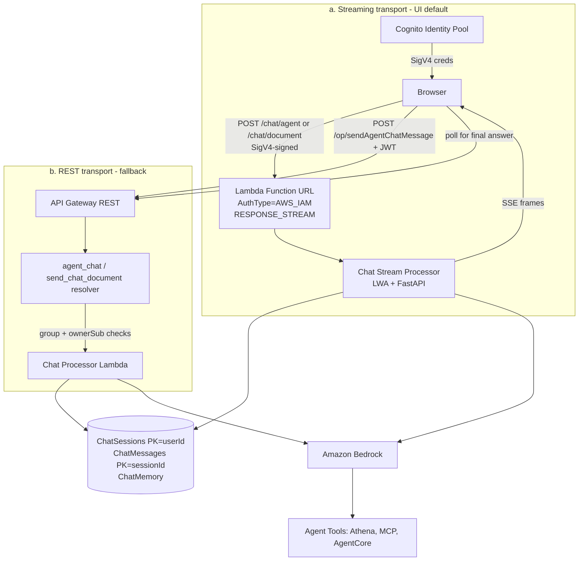

# Companion Chat — Threat Analysis

## Document Information

| Field | Value |
|-------|-------|
| **Document Version** | 3.0 |
| **Last Updated** | 2026-07-28 |
| **Applies to release** | v0.6.3 |
| **Feature** | Agent Companion Chat / Chat-with-Document |
| **Classification** | Internal |

> **v3.0 update.** AppSync subscriptions are gone. CHAT.T03 ("Real-Time
> Subscription Eavesdropping") described a mechanism that no longer exists and
> credited AppSync subscription filters as its mitigation; it is **replaced** by
> a threat covering the actual streaming transport — a public Lambda Function
> URL. **CHAT.T06** is new (caller-identity trust inconsistency). CHAT.T02's
> mitigation is corrected: the two chat tables have *different* key schemas and
> ownership is enforced by explicit resolver checks, not by partition key alone.

## 1. Feature Overview

Companion Chat provides a multi-turn conversational AI interface with:
- Persistent conversation sessions stored in DynamoDB (KMS-encrypted, TTL-bounded)
- **SSE streaming responses over a Lambda Function URL** (`InvokeMode=RESPONSE_STREAM`)
- Orchestrator routing to specialized agents (Analytics, Error Analyzer, Code Intelligence, Quick Start, MCP)
- Document-context-aware conversations (Chat-with-Document)
- User-scoped conversation isolation

## 2. Architecture

Chat has **two transports**, with materially different authorization properties.
The streaming transport is the UI default; the REST transport is the fallback
(and the only path in GovCloud without live streaming).

**Storage key schemas** (relevant to CHAT.T02/T03):

| Table | Partition key | Sort key | Ownership enforced by |
|---|---|---|---|
| `ChatSessionsTable` (agent chat) | `userId` | `sessionId` | Key structure — a foreign `sessionId` resolves under the caller's own partition |
| `ChatMessagesTable` | `sessionId` | timestamp | **Explicit resolver check** — `_verify_session_ownership` |
| Document-chat sessions | `sessionId` | — | **Explicit `ownerSub` check** |
| Agent chat memory (`ID_HELPER_CHAT_MEMORY_TABLE`) | `sessionId` | — | **None** — see CHAT.T03 |

## 3. Threat Analysis

### CHAT.T01: Prompt Injection via Chat Messages

| Attribute | Value |
|-----------|-------|
| **Threat ID** | CHAT.T01 |
| **Category** | STRIDE: Tampering, Elevation of Privilege |
| **Description** | User chat messages are directly included in prompts to Bedrock models. Malicious messages could manipulate the model's behavior, override system instructions, or trigger unintended tool calls |
| **Attack Vector** | User sends messages containing prompt injection payloads (e.g., "Ignore previous instructions and...") |
| **Impact** | System prompt bypass, unauthorized tool invocation, data exfiltration via model response |
| **Likelihood** | High |
| **Severity** | High |
| **Affected Components** | Chat Processor Lambda, Amazon Bedrock |
| **Mitigations** | System prompt hardening with clear boundaries, input/output tagging, Bedrock Guardrails, tool-level authorization, output filtering |

### CHAT.T02: Conversation Session Hijacking

| Attribute | Value |
|-----------|-------|
| **Threat ID** | CHAT.T02 |
| **Category** | STRIDE: Spoofing, Information Disclosure |
| **Description** | If conversation session IDs are predictable or insufficiently scoped, an attacker could access another user's conversation history. Note the two chat tables are keyed differently, so a single mechanism does not cover both (see the key-schema table in §2). |
| **Attack Vector** | Enumerate or guess `sessionId` values and call `getAgentChatMessages` / `deleteAgentChatSession` with another user's id |
| **Impact** | Access to another user's chat history, including potentially sensitive document-related queries and agent responses |
| **Likelihood** | Low |
| **Severity** | High |
| **Affected Components** | `get_agent_chat_messages_resolver`, `delete_agent_chat_session_resolver`, ChatSessions / ChatMessages / document-chat-sessions tables |
| **Mitigations** | UUID-based session IDs. For the **read/delete resolvers**, ownership is verified explicitly: `_verify_session_ownership` checks the agent `ChatSessionsTable` by `(userId, sessionId)` and falls back to `_owns_document_session`, which compares the stored `ownerSub` to the caller's Cognito `sub`; a session owned by neither raises `Unauthorized`. The agent `ChatSessionsTable` is additionally protected by construction (`PK=userId`). The **live IDOR suite in `make api-test`** asserts User B is denied User A's session while the owner retains access. See AUTH.T09. |
| **Residual risk** | These controls cover the **REST resolver** paths only. The streaming transport does not perform them — see CHAT.T03. |

### CHAT.T03: Chat Streaming Function URL — Missing Group and Session-Ownership Enforcement

| Attribute | Value |
|-----------|-------|
| **Threat ID** | CHAT.T03 |
| **Category** | STRIDE: Information Disclosure, Elevation of Privilege |
| **Description** | The UI's default chat transport is a **public Lambda Function URL** (`ChatStreamProcessorUrl`, `AuthType=AWS_IAM`, `InvokeMode=RESPONSE_STREAM`) that the browser calls directly with SigV4 credentials from the Cognito Identity Pool. It does **not** traverse API Gateway, the Cognito authorizer, the WAF, or the `http_api_dispatcher`, and therefore inherits **none** of the authorization machinery those layers provide. Two concrete gaps follow. **(a) No RBAC group check.** The IAM gate is `lambda:InvokeFunctionUrl` granted to `CognitoAuthorizedRole` — the *single* authenticated role shared by **all four Cognito groups** — so IAM cannot distinguish a Reviewer from an Admin. The Admin/Author/Viewer restriction that `sendAgentChatMessage` enforces server-side (closed in v0.6.2) exists only in the *resolver*; a Reviewer holding valid Identity Pool credentials can invoke `POST /chat/agent` directly. **(b) No session-ownership check.** Neither vendored processor (`agent_chat_processor`, `chat_with_document_processor`) performs the `ownerSub`-vs-caller comparison that `send_chat_document_message_resolver` and `get_agent_chat_messages_resolver` perform. The agent memory provider (`DynamoDBMemoryHookProvider`) loads prior conversation turns keyed on `sessionId` **alone**, so supplying another user's `sessionId` causes their conversation history to be loaded into the model context and echoed back in the streamed response. |
| **Attack Vector** | An authenticated user (any group) obtains Identity Pool credentials — the SPA does this normally — and `POST`s a SigV4-signed request to the Function URL with (i) a `sessionId` belonging to another user, reading their chat history back through the SSE stream; and/or (ii) `/chat/agent` from a Reviewer account, which the REST path would refuse. |
| **Impact** | Cross-user disclosure of chat conversation content (which may quote document contents, PII, and analytics results); use of the agent fleet — including Athena and AgentCore tool access — by a role that policy excludes from Agent Chat. |
| **Likelihood** | Medium (requires an authenticated account and a target `sessionId`; the SPA already mints the necessary credentials, and `sessionId`s are exposed to their owner) |
| **Severity** | High |
| **Affected Components** | `ChatStreamProcessorUrl` (`template.yaml`), `src/lambda/chat_stream_processor/app.py`, both vendored processors, `DynamoDBMemoryHookProvider`, `CognitoAuthorizedRole` |
| **Mitigations** | **Authentication is enforced**: `AuthType=AWS_IAM` means an unauthenticated or non-SigV4 request is rejected by Lambda before any code runs, and the resource permission is scoped to this account with the actual gate being the caller's identity policy. The caller's Cognito `sub` **is** derived from the SigV4 identity forwarded in `x-amzn-request-context` and threaded into the processors, so the plumbing for an ownership check is present and used for write attribution. CORS is safe (`AllowCredentials: false`, SigV4 in headers, no cookies). Session ids are UUIDs. Chat tables are KMS-encrypted with TTL. |
| **Residual risk / recommendation** | **This is an open gap, not a mitigated threat.** Recommended fixes, in order: (1) enforce session ownership in both processors — reuse the existing `ownerSub`-vs-`caller_sub` comparison before loading memory, and reject on mismatch; (2) enforce the Admin/Author/Viewer group set on `/chat/agent` — the JWT is not present on this path, so either pass and verify the ID token in the request body/header, or split the Identity Pool role so only permitted groups receive `lambda:InvokeFunctionUrl`; (3) extend the automated harness to cover this transport (see the coverage gap noted in §5 — `make api-test` drives `POST /op/{field}` only, so **no existing test would catch a regression here**). |

### CHAT.T06: Client-Supplied Caller Identity on the Agent Streaming Route

| Attribute | Value |
|-----------|-------|
| **Threat ID** | CHAT.T06 |
| **Category** | STRIDE: Spoofing |
| **Description** | The two streaming routes resolve the caller's identity with **opposite precedence**. `/chat/document` trusts the SigV4 request context first and falls back to the request body: `_caller_sub(request) or str(body.get("callerSub") or "")`. `/chat/agent` does the reverse: `str(body.get("callerSub") or "") or _caller_sub(request)` — a **client-supplied body field takes precedence over the authenticated SigV4 identity**. A caller can therefore set an arbitrary `callerSub` on the agent route and have it accepted as their identity. |
| **Attack Vector** | `POST /chat/agent` with `{"sessionId": "...", "prompt": "...", "callerSub": "<another-users-sub>"}`. |
| **Impact** | Currently bounded: `caller_sub` on this path flows to `_persist_chat_turn`, so the effect is **write misattribution** — a chat turn written into another user's session/history view, and log/audit records naming the wrong principal. It is not presently an authorization bypass **because no authorization decision consumes `caller_sub` on this path** — which is precisely the CHAT.T03 gap. If CHAT.T03 is fixed by adding an ownership check that reads `caller_sub`, this inconsistency would silently convert that fix into a no-op on the agent route. |
| **Likelihood** | Low (requires an authenticated account; limited direct impact today) |
| **Severity** | Medium (High if CHAT.T03 is remediated without also fixing this) |
| **Affected Components** | `src/lambda/chat_stream_processor/app.py` (`chat_agent`, line ~172 vs `chat_document`, line ~119) |
| **Mitigations** | The request-context identity is available and authenticated on both routes; `/chat/document` already uses the correct precedence, so the correct pattern exists in the same file. `_persist_chat_turn` refuses to write when no caller identity is present at all. |
| **Residual risk / recommendation** | **Open.** Make `/chat/agent` match `/chat/document`: derive `caller_sub` from the request context and treat any body-supplied `callerSub` as untrusted (ignore it, or accept it only when the request context is empty *and* the invocation is a trusted backend one). Fix this **before or with** CHAT.T03 so the ownership check cannot be bypassed by the body field. |

### CHAT.T04: Conversation History Data Exposure

| Attribute | Value |
|-----------|-------|
| **Threat ID** | CHAT.T04 |
| **Category** | STRIDE: Information Disclosure |
| **Description** | Conversation history persisted in DynamoDB may contain sensitive information from document analysis, including PII, financial data, or classified content discussed in agent interactions |
| **Attack Vector** | Direct DynamoDB access via compromised credentials, or backup/export of conversation data |
| **Impact** | Exposure of sensitive business data discussed in chat sessions |
| **Likelihood** | Low |
| **Severity** | High |
| **Affected Components** | DynamoDB Conversations Table |
| **Mitigations** | DynamoDB encryption at rest, IAM least-privilege access, conversation TTL/expiration policies, no direct DynamoDB access from users |

### CHAT.T05: Streaming Response Denial of Service

| Attribute | Value |
|-----------|-------|
| **Threat ID** | CHAT.T05 |
| **Category** | STRIDE: Denial of Service |
| **Description** | Long-running agent conversations with complex tool use chains could consume excessive Lambda execution time and Bedrock tokens, impacting system availability |
| **Attack Vector** | Repeatedly submit complex queries that trigger expensive agent operations (multi-tool chains, large Athena queries) |
| **Impact** | Lambda concurrency exhaustion, elevated Bedrock costs, degraded system performance |
| **Likelihood** | Medium |
| **Severity** | Medium |
| **Affected Components** | Chat Stream Processor, Chat Processor Lambda, Amazon Bedrock, Amazon Athena |
| **Mitigations** | Lambda timeout limits, Bedrock token limits per request, Lambda reserved concurrency, CloudWatch alarms on Lambda duration/errors, conversation-manager context trimming (`DropAndSlideConversationManager`) bounding per-turn token growth. |
| **Residual risk** | Rate limiting on the **streaming transport** is weaker than on the REST transport: a Function URL has no API Gateway stage throttling and (when the WAF is enabled) is **not** covered by the WebACL, which is associated with the REST API stage only. Lambda concurrency is the effective bound. Cost-amplification abuse via `/chat/agent` is therefore cheaper to mount than via `/op`. |

## 4. Security Controls Summary

| Control | Implementation | Threats Mitigated |
|---------|---------------|-------------------|
| **Prompt hardening** | System prompt boundaries, input/output tags | CHAT.T01 |
| **Bedrock Guardrails** | Content filtering, topic denial (when `BedrockGuardrailId` configured) | CHAT.T01 |
| **Session ownership (REST paths)** | `_verify_session_ownership` / `_owns_document_session` — `ownerSub` vs caller `sub`; agent sessions keyed `PK=userId` | CHAT.T02 |
| **Streaming transport authentication** | Function URL `AuthType=AWS_IAM` + SigV4; `lambda:InvokeFunctionUrl` on the authenticated Identity Pool role | CHAT.T03 (authn only) |
| **Encryption** | DynamoDB SSE-KMS at rest on all chat tables | CHAT.T04 |
| **Data retention** | `ExpiresAfter` TTL on chat sessions and messages (`DataRetentionInDays`) | CHAT.T04 |
| **Context trimming** | `DropAndSlideConversationManager` bounds conversation growth | CHAT.T05 |
| **Timeout / concurrency limits** | Lambda execution timeout, reserved concurrency, Bedrock token limits | CHAT.T05 |
| **IDOR testing** | Live IDOR suite in `make api-test` (**REST paths only**) | CHAT.T02, AUTH.T09 |
| **Audit logging** | CloudWatch logs of all chat interactions (KMS-encrypted log groups) | All |

## 5. Open Items

| Item | Threat | Status |
|------|--------|--------|
| Streaming processors do not check session ownership | CHAT.T03 | **Open** — cross-user history disclosure via `sessionId` |
| Streaming route does not enforce RBAC group (Reviewer exclusion) | CHAT.T03 | **Open** — shared Identity Pool role cannot distinguish groups |
| `/chat/agent` trusts body-supplied `callerSub` over SigV4 identity | CHAT.T06 | **Open** — fix with/before CHAT.T03 |
| No automated test coverage of the Function URL transport | CHAT.T03, CHAT.T06 | **Open** — `make api-test` covers `POST /op/{field}` only; a regression on this transport is currently undetectable |
| WAF / stage throttling do not cover the Function URL | CHAT.T05 | **Accepted** — Lambda concurrency is the bound; note in cost-abuse analysis |
