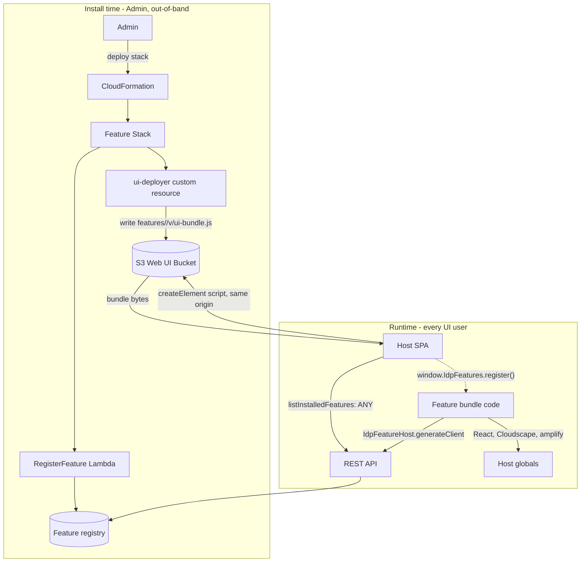

# Feature Platform / Extensions — Threat Analysis

## Document Information

| Field | Value |
|-------|-------|
| **Document Version** | 1.0 |
| **Last Updated** | 2026-07-28 |
| **Applies to release** | v0.6.3 |
| **Feature** | Feature Platform (installable Extension Features) |
| **Classification** | Internal |

> **New document.** The Feature Platform was added after threat model v2.0 and
> had **no threat coverage**. It introduces the sharpest new trust-boundary
> crossing in the v0.6 architecture: third-party JavaScript executing in the
> host SPA's own origin, inside the authenticated user's session.

## 1. Feature Overview

The Feature Platform lets an operator install **Extension Features** into a
running IDP deployment. A feature is an independently-deployed CloudFormation
stack that may contribute any of:

- **A UI bundle** (`ui-bundle.js`) rendered as a page inside the host Web UI
- **A feature API** (its own API Gateway routes / Lambdas)
- **Pipeline hooks** (`preprocessing`, `postExtraction`, `postRuleValidation`, …)
- **A config preset** applied to the host's configuration
- **AgentCore Runtime agents**

Bundled examples: PII Anonymization, Test Set Generator (`idp-data-generator`),
Sample: Health Insurance Review, Sample: Document Status. Third-party and
customer-authored features use the same mechanism (`lib/idp_feature_sdk`).

## 2. Architecture

**Key mechanics** (`src/ui/src/components/feature-page/FeatureLoader.tsx`,
`feature-host-globals.ts`):

- The bundle URL is normalized to a **same-origin absolute path**
  (`/<uiBundlePath>/ui-bundle.js`) and injected as a `<script>` tag.
- The host pre-exposes `React`, `ReactDOM`, Cloudscape, `aws-amplify`, and
  `react-router-dom` on `window` so the UMD bundle can resolve them.
- The host exposes `window.IdpFeatureHost.generateClient` — a REST-backed,
  GraphQL-shaped client that calls `POST /op/{field}` **with the current user's
  credentials**.
- The bundle self-registers via `window.IdpFeatures.register(featureId, …)`;
  the host renders its `Component` with a `FeatureContext`.

## 3. Threat Analysis

### FEAT.T01: Feature UI Bundle Executes Unsandboxed in the Host Origin

| Attribute | Value |
|-----------|-------|
| **Threat ID** | FEAT.T01 |
| **Category** | STRIDE: Tampering, Information Disclosure, Elevation of Privilege |
| **Description** | An installed feature's `ui-bundle.js` is loaded via `document.createElement('script')` from the **host's own origin** and executes with the full privileges of the host SPA in the visiting user's browser. It is not isolated by an iframe, a worker, a separate origin, or CSP (the CloudFront CSP permits `'unsafe-inline'`/`'unsafe-eval'` and `script-src … https:`; in APIGateway hosting mode there is no CSP at all — UI.T07). The bundle can read the DOM and any in-memory/session-storage tokens, call `POST /op/{field}` as the user via the host-provided `IdpFeatureHost.generateClient`, and reach any origin the CSP `connect-src` allows. Installing a feature therefore grants that feature's code the **effective privilege of every user who loads the UI**, including Admins. |
| **Attack Vector** | (a) A malicious or backdoored third-party feature is installed by an Admin who evaluated its *documented* behavior, not its bundle contents. (b) A legitimate feature's build/supply chain is compromised upstream, and the published bundle differs from what was reviewed. (c) An attacker who obtains write access to the feature's prefix in the Web UI bucket (or to the ui-deployer's role) replaces the bundle. |
| **Impact** | Full compromise of the Web UI session for every user: exfiltration of document content and extracted PII via authorized API calls, silent configuration tampering (which redirects all subsequent document processing — PM.T06), privilege abuse as an Admin visitor, credential/token theft. |
| **Likelihood** | Low (requires an Admin install decision or a supply-chain compromise) |
| **Severity** | **Critical** |
| **Affected Components** | `FeatureLoader.tsx`, `feature-host-globals.ts`, S3 Web UI Bucket, feature ui-deployer roles, `listInstalledFeatures` |
| **Mitigations** | **Install is a privileged, deliberate, out-of-band act**: a feature is a CloudFormation stack an Admin deploys with their own credentials — it cannot be installed through the UI by a lower-privileged user, and `subscribeFeature`/`unsubscribeFeature`/`getFeatureLaunchUrl` are **Admin-only** (server-side enforced; formerly GAP-06). The ui-deployer's S3 write is **prefix-scoped** to `features/<featureId>/v<version>/` via an explicit IAM policy, so one feature cannot overwrite another's bundle or the host SPA's own assets. Bundles are served same-origin (no third-party CDN in the trust path) with `Cache-Control: max-age=300`, so a malicious version can be replaced and propagate within minutes rather than being pinned for a year. The pipeline-hooks dispatcher only invokes Lambdas tagged `idp:feature-id`, bounding hook registration. Features are distributed with source in-repo for the bundled ones. |
| **Residual risk / recommendation** | **No integrity verification occurs at load time** — there is no Subresource Integrity (SRI) hash, no signature, and no version pinning check against a manifest digest (`expectedVersion` only produces a warning; loading proceeds regardless). Recommended, in order: (1) record a SHA-384 digest of the bundle in the feature registry at install time and set `script.integrity` from it in `FeatureLoader` — this is a small change that converts (b) and (c) from silent to blocked; (2) document the trust decision explicitly in the install flow ("installing a feature grants it your users' UI privileges"); (3) longer term, consider rendering third-party feature UIs in a sandboxed iframe on a distinct origin with a narrow `postMessage` API instead of `window` globals. Treat FEAT.T01 as **accepted-with-compensating-controls for first-party/bundled features and open for third-party features**. |

### FEAT.T02: Feature Registry Enumeration by Any Authenticated User

| Attribute | Value |
|-----------|-------|
| **Threat ID** | FEAT.T02 |
| **Category** | STRIDE: Information Disclosure |
| **Description** | `listInstalledFeatures`, `listCatalogFeatures`, and `checkFeatureEntitlement` are readable by **any authenticated user** (`groups: ANY`). They disclose which extensions are installed, their versions, and their `uiBundlePath`s. |
| **Attack Vector** | A low-privileged authenticated user calls `listInstalledFeatures` to inventory the deployment's extensions and versions. |
| **Impact** | Reconnaissance: an attacker learns which features (and versions) are present, enabling targeting of a known-vulnerable feature version. Low direct impact — no document data is exposed. |
| **Likelihood** | Medium (trivially callable) |
| **Severity** | Low |
| **Affected Components** | `list_installed_features`, `list_catalog_features`, `check_feature_entitlement` |
| **Mitigations** | Necessarily readable by all roles — the host SPA must render the Extensions nav for every user, so this is a **design requirement**, not an oversight. No secrets, credentials, or document data are returned. Version information is also inferable from the loaded bundle paths. Install/modify operations are Admin-only. |
| **Status** | **Accepted risk** — inherent to rendering a per-user nav; disclosure is limited to non-sensitive inventory metadata. |

### FEAT.T03: Feature Stack IAM Privilege and Host Resource Access

| Attribute | Value |
|-----------|-------|
| **Threat ID** | FEAT.T03 |
| **Category** | STRIDE: Elevation of Privilege, Tampering |
| **Description** | A feature stack creates its own IAM roles and is granted access to host resources it imports (e.g. `${MainStackName}-InputBucketName`, `-WebUIBucketName`, `-UsersTableName`). A feature can therefore read/write host data directly from its own Lambdas, independent of the host's API authorization. A hook feature additionally receives full document content in-band. |
| **Attack Vector** | A malicious or over-permissioned feature template grants its own role broader host access than its function requires, then reads document content or writes configuration outside the host's RBAC controls. |
| **Impact** | Data exfiltration or tampering that bypasses the host's resolver-side authorization entirely, because it operates at the AWS API layer rather than through `POST /op/{field}`. |
| **Likelihood** | Low (requires installing a hostile/over-broad feature) |
| **Severity** | High |
| **Affected Components** | Feature templates, feature Lambda execution roles, host `Fn::ImportValue` exports |
| **Mitigations** | Features declare their host imports explicitly in their template, so the grant surface is **reviewable in the IaC before install**. `PermissionsBoundaryArn` is forwarded to the feature-platform nested stack and attached to the roles it creates (fixed in v0.6.1, with a static regression test asserting every deployed-stack template attaches the boundary and forwards the parameter) — so an SCP-enforced account can bound a feature's maximum privilege centrally. Feature-owned data (e.g. the PII mapping table) lives in the feature's own stack, encrypted, rather than in host tables. Install requires CloudFormation privileges. |
| **Residual risk** | The permissions boundary is the real control here and is only as tight as the account's boundary policy. In accounts with no boundary, a feature stack's roles are bounded only by the installing principal's own privileges. Recommend requiring `PermissionsBoundaryArn` for deployments that install third-party features. |

### FEAT.T04: Stale or Downgraded Feature Bundle Served to Users

| Attribute | Value |
|-----------|-------|
| **Threat ID** | FEAT.T04 |
| **Category** | STRIDE: Tampering, Denial of Service |
| **Description** | The host loads whatever bundle exists at the registry's `uiBundlePath`. If a security fix is published under the **same** feature version, browsers and CDN edges may continue serving the old bytes; conversely, a rollback to a known-vulnerable version is not detected. |
| **Attack Vector** | A feature hotfix is republished at the same version; users continue running the vulnerable bundle from cache. Or an attacker with the feature's S3 prefix write access reverts the bundle to an older vulnerable build. |
| **Impact** | A patched client-side vulnerability remains exploitable for the cache lifetime; version-based assurance is unreliable. |
| **Likelihood** | Low |
| **Severity** | Medium |
| **Affected Components** | Feature ui-deployers, S3 Web UI Bucket, CloudFront TTL, `FeatureLoader` version check |
| **Mitigations** | Feature ui-deployers set `Cache-Control: max-age=300` (down from a previously-shipped `max-age=31536000, immutable`, which pinned a stale bundle for up to a year on same-version republish), matching the CloudFront TTL — so an update propagates within minutes. The module-level registry loads a given feature's script once per page load, so a mid-session swap does not take effect until reload. `expectedVersion` mismatches are logged. |
| **Residual risk** | The `expectedVersion` check **warns but still loads**, and there is no digest pinning (see FEAT.T01 recommendation 1, which also closes this). Prefer publishing security fixes under a **new version** so the registry path itself changes. |

## 4. Security Controls Summary

| Control | Implementation | Threats Mitigated |
|---------|---------------|-------------------|
| **Admin-gated install/subscribe** | `subscribeFeature` / `unsubscribeFeature` / `getFeatureLaunchUrl` Admin-only, server-side enforced | FEAT.T01, FEAT.T03 |
| **Out-of-band deployment** | Feature install is a CloudFormation stack deploy, not a UI action | FEAT.T01, FEAT.T03 |
| **Prefix-scoped bundle writes** | ui-deployer IAM policy limited to `features/<id>/v<ver>/` | FEAT.T01, FEAT.T04 |
| **Same-origin bundle delivery** | Bundles served from the host Web UI bucket; no third-party CDN in the trust path | FEAT.T01 |
| **Permissions boundary** | `PermissionsBoundaryArn` forwarded + attached to feature roles; static regression test | FEAT.T03 |
| **Hook tag gating** | Pipeline-hooks dispatcher only invokes Lambdas tagged `idp:feature-id` | FEAT.T03 |
| **Short bundle cache TTL** | `Cache-Control: max-age=300` matching CloudFront TTL | FEAT.T04 |
| **Feature-owned sensitive storage** | Feature data (e.g. PII mappings) in the feature's own encrypted tables | FEAT.T03 |

## 5. Open Items

| Item | Threat | Status |
|------|--------|--------|
| No SRI/digest/signature verification on `ui-bundle.js` at load | FEAT.T01, FEAT.T04 | **Open** — recommended primary fix |
| Feature UI runs unsandboxed in host origin with host API client | FEAT.T01 | **Accepted** for bundled/first-party; **open** for third-party |
| `expectedVersion` mismatch warns but loads anyway | FEAT.T04 | **Open** |
| No permissions boundary required for third-party feature installs | FEAT.T03 | **Open** — recommend documenting as a prerequisite |
| Feature registry readable by all roles | FEAT.T02 | **Accepted** — design requirement |
