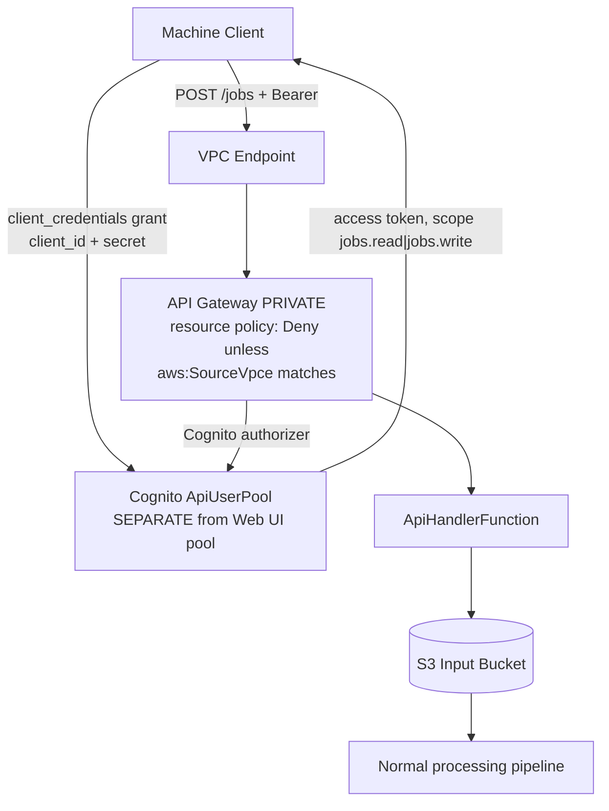

# Jobs API (Machine-to-Machine) — Threat Analysis

## Document Information

| Field | Value |
|-------|-------|
| **Document Version** | 1.0 |
| **Last Updated** | 2026-07-28 |
| **Applies to release** | v0.6.3 |
| **Feature** | Jobs REST API (`EnableJobsApi=true`) |
| **Classification** | Internal |

> **New document.** The Jobs API had **no threat coverage**. It is significant
> because it is a **second authentication realm**: a separate Cognito user pool
> with OAuth `client_credentials` clients that are *not* subject to the 4-group
> RBAC model the rest of the threat model assumes.

## 1. Feature Overview

`EnableJobsApi=true` stands up a machine-to-machine batch submission API
**in addition to** the Web UI (it does not remove the UI — that is the separate
`idp-cli deploy --headless` template transform). It provides:

- A **PRIVATE** API Gateway REST API with `/jobs` endpoints
- A **separate Cognito user pool** (`ApiUserPool`) with a `client_credentials`
  app client and a `GenerateSecret: true` client secret
- OAuth scopes `idp-api/jobs.read` and `idp-api/jobs.write`
- Supporting Lambdas (`ApiHandlerFunction`) that submit documents for processing

> **Parameter rename (v0.6.2, breaking).** `EnableHeadless` → `EnableJobsApi`.
> Existing stacks must supply the new name on their next update.

## 2. Architecture

**Required parameters**: `EnableJobsApi=true` requires VPC parameters
(`JobsApiRequiresVPC` rule) and an `ApiGatewayVpcEndpointId`.

## 3. Threat Analysis

### JOB.T01: Jobs API Clients Bypass the Cognito Group RBAC Model

| Attribute | Value |
|-----------|-------|
| **Threat ID** | JOB.T01 |
| **Category** | STRIDE: Elevation of Privilege |
| **Description** | The Jobs API authenticates against its **own** Cognito user pool (`ApiUserPool`), entirely separate from the Web UI's `UserPool`. Its clients are OAuth `client_credentials` principals with **scopes**, not Cognito **groups**. Consequently none of the authorization machinery this threat model documents for the UI API applies: there are no Admin/Author/Reviewer/Viewer groups, no `allowedConfigVersions` config-version scoping, and no per-operation resolver group checks. A principal holding a `jobs.write` token can submit documents for processing without being any named user, and its submissions are not constrained to a configuration version. |
| **Attack Vector** | An attacker who obtains the client id + secret (from CI configuration, a `.env` file, a build log, or an over-shared secrets store) mints tokens indefinitely and submits arbitrary documents for processing, or reads job status for all jobs via `jobs.read`. |
| **Impact** | Unauthorized document submission and processing (cost amplification, injection of adversarial documents that reach the models — PM.T01), and disclosure of job metadata. Not bounded by config-version scope, so a compromised client is not limited to one tenant's configuration the way a scoped UI user is. |
| **Likelihood** | Low (requires the client secret **and** network position inside the VPC) |
| **Severity** | High |
| **Affected Components** | `ApiUserPool`, `ApiResourceServer`, `ApiAppClient`, `ApiGateway` (PRIVATE), `ApiHandlerFunction` |
| **Mitigations** | The API is **`EndpointConfiguration: PRIVATE`** with a resource policy that **denies** any invocation whose `aws:SourceVpce` does not match the supplied VPC endpoint — so the endpoint is not reachable from the internet at all, and a leaked secret alone is insufficient without network access. Scopes are **separated by intent** (`jobs.read` vs `jobs.write`), so a read-only integration need not hold write capability. The feature is **off by default** (`EnableJobsApi=false`) and, when enabled, is guarded by a CloudFormation rule requiring VPC parameters. The separate user pool means a Jobs API secret compromise does **not** grant Web UI access or expose human user accounts. |
| **Residual risk / recommendation** | The two-realm design is deliberate and sound, but it must be **documented as such** so operators do not assume UI RBAC covers this path. A single shared client with both scopes is the default shape; recommend (1) issuing separate clients per integration with the narrowest scope, (2) rotating the client secret on a schedule, and (3) noting explicitly in the deployment docs that Jobs API submissions are **not** config-version scoped. |

### JOB.T02: Jobs API Is Outside the Automated Authorization Test Harness

| Attribute | Value |
|-----------|-------|
| **Threat ID** | JOB.T02 |
| **Category** | STRIDE: Elevation of Privilege (detection gap) |
| **Description** | `make api-test` / `make api-test-static` derive their operation universe from the UI dispatcher (`FIELD_FUNCTION_MAP` ∪ `ddb_direct._HANDLED` ∪ `FIELD_ALIASES`) and drive `POST /op/{field}`. The Jobs API's `/jobs` routes are **not** in that universe, so no automated test asserts their authorization behavior. A regression that widened a Jobs API route's access, or dropped a scope requirement, would not fail the security gate. |
| **Attack Vector** | Not directly attackable — this is a **detection** gap that allows another defect to ship undetected. |
| **Impact** | An authorization regression on the Jobs API reaches production without a failing test, unlike the equivalent regression on the UI API. |
| **Likelihood** | Low |
| **Severity** | Medium |
| **Affected Components** | `scripts/test_api_rbac.py`, `scripts/sdlc/scan_api_rbac.py`, `scripts/api_rbac_expectations.yaml` |
| **Mitigations** | The Jobs API surface is **small and static** (a handful of `/jobs` routes vs 97 UI operations), so the review burden is low and drift is unlikely. Authorization is enforced by the API Gateway Cognito authorizer plus scope configuration in the template — declarative IaC rather than per-resolver imperative code, which is the class of defect the UI harness exists to catch (AUTH.T08). The `zapdast` deployment-variant probe and the `stacktest-jobsapi` deploy-variant test exercise the deployed Jobs API stack. |
| **Residual risk / recommendation** | Add a small scope-negative test (a `jobs.read`-only token attempting a write route must be refused, and an unauthenticated request must 401) to the Jobs API stack test. Low cost, closes the gate asymmetry. |

### JOB.T03: Static Client Secret with No Rotation Mechanism

| Attribute | Value |
|-----------|-------|
| **Threat ID** | JOB.T03 |
| **Category** | STRIDE: Spoofing |
| **Description** | `ApiAppClient` is created with `GenerateSecret: true`. The client id/secret pair is long-lived, has no built-in rotation or expiry, and is typically stored in a CI system or application configuration to mint tokens. Unlike a human user's credentials, there is no MFA, no password policy, and no global sign-out equivalent. |
| **Attack Vector** | Secret leaks via source control, CI logs, container image layers, or an over-broad secrets-store grant; the holder mints valid tokens until the secret is manually rotated. |
| **Impact** | Persistent unauthorized access at the granted scopes for as long as the secret remains valid — potentially indefinitely, since nothing forces rotation. |
| **Likelihood** | Low |
| **Severity** | Medium |
| **Affected Components** | `ApiAppClient`, consuming integrations |
| **Mitigations** | Access tokens minted from the secret are themselves short-lived. The PRIVATE endpoint means the secret is unusable without VPC network position (the dominant compensating control — see JOB.T01). Rotation is possible at any time by updating the client. CloudTrail records token issuance and API invocations for detection. |
| **Residual risk / recommendation** | Document a rotation procedure and cadence; prefer sourcing the secret from AWS Secrets Manager with automatic rotation over embedding it in CI configuration. Consider per-integration clients so one leak has a bounded blast radius and can be revoked independently. |

## 4. Security Controls Summary

| Control | Implementation | Threats Mitigated |
|---------|---------------|-------------------|
| **PRIVATE endpoint + VPCe resource policy** | `Deny` unless `aws:SourceVpce` matches; no internet reachability | JOB.T01, JOB.T03 |
| **Separate authentication realm** | Dedicated `ApiUserPool`; a Jobs API compromise does not reach the Web UI or human accounts | JOB.T01 |
| **Scope separation** | `idp-api/jobs.read` vs `idp-api/jobs.write` | JOB.T01 |
| **Off by default** | `EnableJobsApi=false`; VPC parameters required when enabled (`JobsApiRequiresVPC`) | JOB.T01 |
| **Short-lived access tokens** | Cognito `client_credentials` token TTL | JOB.T03 |
| **Deploy-variant stack test** | `make stacktest-jobsapi` exercises the deployed Jobs API | JOB.T02 |
| **Audit logging** | CloudTrail token issuance + API Gateway access logs (at INFO/DEBUG `LogLevel`) | All |

## 5. Open Items

| Item | Threat | Status |
|------|--------|--------|
| Jobs API submissions are not config-version scoped | JOB.T01 | **Accepted by design** — document explicitly so UI RBAC is not assumed to apply |
| No scope-negative test in the automated gate | JOB.T02 | **Open** — small addition to the Jobs API stack test |
| Client secret rotation not automated or documented | JOB.T03 | **Open** — recommend Secrets Manager + per-integration clients |
