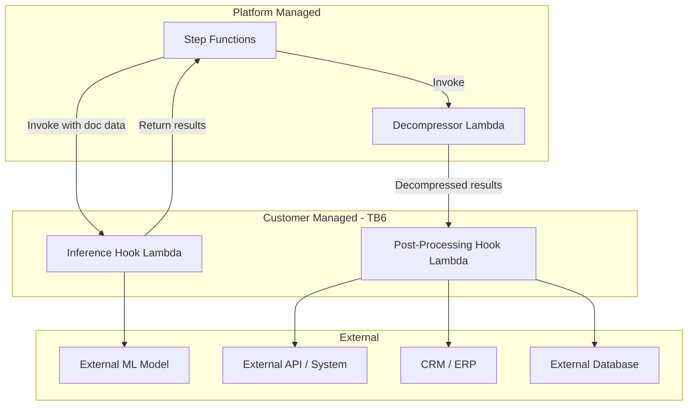

# Lambda Hooks — Threat Analysis

## Document Information

| Field | Value |
|-------|-------|
| **Document Version** | 3.0 |
| **Last Updated** | 2026-07-28 |
| **Applies to release** | v0.6.3 |
| **Feature** | Lambda Hooks (Inference & Post-Processing) |
| **Classification** | Internal |

## 1. Feature Overview

Lambda Hooks provide extensibility points for customer-managed code execution within the processing pipeline:

### 1.1 Inference Hook
- Invoked during extraction step as an alternative or supplement to Bedrock inference
- Receives document data and context, returns structured extraction results
- Enables integration with custom models, external ML services, or specialized processing logic

### 1.2 Post-Processing Hook
- Invoked after document processing completes
- Receives full processing results (decompressed) including all extracted data
- Enables integration with downstream systems (databases, CRMs, ERPs, notifications)
- Results are decompressed by a platform-managed Decompressor Lambda before hook invocation

## 2. Architecture

## 3. Threat Analysis

### HOOK.T01: Malicious Customer Code Execution

| Attribute | Value |
|-----------|-------|
| **Threat ID** | HOOK.T01 |
| **Category** | STRIDE: Tampering, Elevation of Privilege |
| **Description** | Customer-managed Lambda hooks execute arbitrary code within the customer's AWS account. Malicious or compromised hook code could abuse its position in the processing pipeline |
| **Attack Vector** | Deploy malicious Lambda function as inference or post-processing hook that exploits its access to document data and AWS resources |
| **Impact** | Data exfiltration, modification of processing results, abuse of IAM permissions, lateral movement within AWS account |
| **Likelihood** | Low |
| **Severity** | Critical |
| **Affected Components** | Customer Lambda hooks, IAM roles |
| **Mitigations** | Customer responsibility for hook security, documentation of security best practices, hook Lambda runs with customer-managed IAM role (separate from platform roles), platform only has invoke permission on hook |

### HOOK.T02: Data Exfiltration via Post-Processing Hook

| Attribute | Value |
|-----------|-------|
| **Threat ID** | HOOK.T02 |
| **Category** | STRIDE: Information Disclosure |
| **Description** | Post-processing hooks receive complete decompressed processing results including all extracted data, PII, and document content. This data could be sent to unauthorized external destinations |
| **Attack Vector** | Post-processing hook sends full document results to unauthorized endpoint |
| **Impact** | Complete exfiltration of all processed document data |
| **Likelihood** | Medium |
| **Severity** | Critical |
| **Affected Components** | Post-Processing Hook Lambda, Decompressor Lambda |
| **Mitigations** | Customer-managed VPC with egress controls on hook Lambda, security review of hook code, network-level monitoring, data loss prevention policies |

### HOOK.T03: Inference Hook Result Tampering

| Attribute | Value |
|-----------|-------|
| **Threat ID** | HOOK.T03 |
| **Category** | STRIDE: Tampering |
| **Description** | Inference hooks return results that feed into the downstream pipeline. A compromised hook could return manipulated extraction results |
| **Attack Vector** | Inference hook returns carefully crafted false extraction data that passes validation but contains incorrect or malicious content |
| **Impact** | Corrupted processing results, incorrect business decisions based on tampered data |
| **Likelihood** | Low |
| **Severity** | High |
| **Affected Components** | Inference Hook Lambda, downstream pipeline steps |
| **Mitigations** | Output schema validation in platform code, assessment step as verification layer, evaluation framework to detect accuracy degradation, human review for critical documents |

### HOOK.T04: Hook Lambda Timeout/Failure Cascade

| Attribute | Value |
|-----------|-------|
| **Threat ID** | HOOK.T04 |
| **Category** | STRIDE: Denial of Service |
| **Description** | Customer hook Lambdas that timeout, fail, or hang can block the processing pipeline, especially if retry policies are aggressive |
| **Attack Vector** | Hook Lambda with infinite loop, external dependency timeout, or resource exhaustion |
| **Impact** | Pipeline processing blocked for affected documents, Step Functions execution stuck |
| **Likelihood** | Medium |
| **Severity** | Medium |
| **Affected Components** | Step Functions, Hook Lambdas |
| **Mitigations** | Step Functions timeout configuration on hook invocation states, error handling with fallback states, CloudWatch alarms on hook failures, DLQ for failed processing |

### HOOK.T05: Privilege Escalation via Hook IAM Role

| Attribute | Value |
|-----------|-------|
| **Threat ID** | HOOK.T05 |
| **Category** | STRIDE: Elevation of Privilege |
| **Description** | If the hook Lambda's IAM role has excessive permissions, compromised hook code could access platform resources beyond its intended scope |
| **Attack Vector** | Hook Lambda with over-permissioned IAM role accesses platform S3 buckets, DynamoDB tables, or other resources |
| **Impact** | Unauthorized access to platform data and resources |
| **Likelihood** | Low |
| **Severity** | High |
| **Affected Components** | Hook Lambda IAM role, platform resources |
| **Mitigations** | Documentation emphasizing least-privilege IAM for hooks, platform resources use resource-based policies that don't grant hook roles access, clear boundary between platform and customer IAM roles |

### HOOK.T06: Preprocessing Hook Operates on the Raw Source Document and Can Halt or Replace It

| Attribute | Value |
|-----------|-------|
| **Threat ID** | HOOK.T06 |
| **Category** | STRIDE: Tampering, Information Disclosure, Denial of Service |
| **Description** | The `preprocessing` hook point (v0.6.2) is materially more powerful than the post-step `postHook` lists this document originally covered. It runs **first** — before BDA/pipeline routing — so it fires in **both** processing modes and even when OCR is disabled, and it operates on the **source document itself** rather than on derived results. It may return `halt: true` to end the execution outright, and it can write replacement documents back to the Input bucket. A preprocessing hook therefore sees every document in its most sensitive, un-redacted form and can suppress, substitute, or mutate any document before any processing occurs. |
| **Attack Vector** | A malicious or compromised preprocessing hook (a) exfiltrates raw source documents including all PII, (b) silently substitutes a benign document for a sensitive one, or (c) returns `halt: true` for targeted documents so they are never processed — a **silent, targeted denial of processing** that is harder to notice than an outright failure. |
| **Impact** | Complete pre-pipeline compromise: exfiltration of raw documents, undetected substitution of content that all downstream results are then derived from, or selective suppression of documents. |
| **Likelihood** | Low (requires registering a hostile hook, which is an Admin/config action) |
| **Severity** | **High** |
| **Affected Components** | Pipeline hooks dispatcher, `preprocessing` config section, S3 Input Bucket, workflow state machine |
| **Mitigations** | Registration is a **configuration action** requiring the Admin/Author group and is config-versioned, attributable, and reversible (PM.T06 controls). The hook is a **separate customer/feature-managed Lambda** with its own IAM role — the platform holds only `lambda:InvokeFunction` on it (HOOK.T01/T05 controls apply unchanged). The dispatcher **only invokes Lambdas tagged `idp:feature-id`**, so an arbitrary ARN cannot be dispatched without that tag. The hook config is a deliberately **generic** `arn` + key/value `args` shape with no feature-specific fields, limiting the platform's own attack surface. `onError: fail` is **terminal** (fail-closed — no fall-through to processing the un-preprocessed original). The distinct, visible **`PREPROCESSING`** document status (abortable like other in-flight statuses) makes a hook that hangs or halts observable in the UI rather than silent, and it is a no-op when no hook is registered (backward-compatible default). |
| **Residual risk** | A `halt: true` return is a legitimate, expected outcome (the PII feature uses it after spawning a replacement document), so a *malicious* halt is not distinguishable from a *correct* one by the platform alone — detection depends on operators noticing documents that never produce results. Recommend monitoring the rate of halted executions and alerting on anomalies. See [PII Anonymization](pii-anonymization.md) for the reference consumer's own threats (PII.T01–T05). |

## 4. Security Controls Summary

| Control | Implementation | Threats Mitigated |
|---------|---------------|-------------------|
| **Invocation-only access** | Platform only has lambda:InvokeFunction on hooks | HOOK.T01, HOOK.T06 |
| **Separate IAM roles** | Hook Lambdas use customer-managed IAM roles | HOOK.T01, HOOK.T05, HOOK.T06 |
| **Hook tag gating** | Dispatcher only invokes Lambdas tagged `idp:feature-id` | HOOK.T06 |
| **Admin-gated registration** | Hook ARNs are set in config (Admin/Author), versioned and auditable | HOOK.T06 |
| **Fail-closed error handling** | `onError: fail` is terminal — no fall-through to un-preprocessed input | HOOK.T06 |
| **Visible in-flight status** | `PREPROCESSING` status is distinct and abortable | HOOK.T06 |
| **Generic hook contract** | `arn` + opaque key/value `args`; no feature-specific fields | HOOK.T06 |
| **Output validation** | Schema validation of hook return values | HOOK.T03 |
| **Timeout handling** | Step Functions timeout on hook states | HOOK.T04 |
| **Error handling** | Fallback states and DLQ | HOOK.T04 |
| **Security documentation** | Best practices guide for hook development | HOOK.T01, HOOK.T02, HOOK.T05 |
| **Network controls** | Customer-managed VPC for hook Lambdas | HOOK.T02 |

## 5. Hook Points (v0.6)

| Hook point | Runs | Sees | Can halt? |
|---|---|---|---|
| `preprocessing` | First, before mode routing; both modes; even with OCR disabled | **Raw source document** | **Yes** (`halt: true`) |
| `postOcr`, `postClassification`, `postExtraction` | After the named step | Derived results for that step | No |
| `postRuleValidation` | After rule validation — **including the skip paths** (no-policy-match, rule-validation-disabled) | Rule validation results | No |
| `PostProcessingLambdaHookFunctionArn` | After document finalization (incl. HITL "Skip All Reviews") | Full document results | No |
