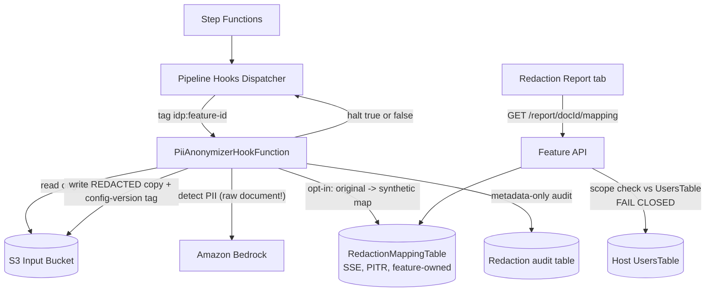

# PII Anonymization & Preprocessing Hook — Threat Analysis

## Document Information

| Field | Value |
|-------|-------|
| **Document Version** | 1.0 |
| **Last Updated** | 2026-07-28 |
| **Applies to release** | v0.6.3 |
| **Feature** | `preprocessing` pipeline hook + bundled PII Anonymization extension |
| **Classification** | Internal |

> **New document.** The `preprocessing` hook point (v0.6.2) and the PII
> Anonymization extension had **no threat coverage**. This feature is unusual in
> that it is *itself* a security control — so its threats are largely about the
> control failing silently, or its own byproducts (the redaction mapping)
> becoming a new disclosure surface.

## 1. Feature Overview

**The `preprocessing` hook** is a generic extension point that runs **first** in
the workflow — before BDA/pipeline routing — so it fires in both processing
modes and even when OCR is disabled, operating on the source document itself.
A hook may return `halt: true` to end the execution. `onError: fail` is
**terminal**: a failed hook stops the execution rather than falling through to
processing the un-preprocessed original. While it runs, document status shows
`PREPROCESSING`.

**PII Anonymization** is the reference consumer: it detects and redacts PII from
source documents **before** classification/extraction models see them, so the
pipeline (and its prompts, logs, and stored results) operates only on
de-identified content. Two modes:

- *redact copy and stop* — the original is deleted; only the redacted copy remains
- *redact copy and continue* — original + redacted proceed as separate documents,
  partitioned by `allowedConfigVersions` RBAC

A **Config Pairing** wizard clones a config version into a matched pair. A
**Redaction Report** tab shows a metadata-only audit; the original→synthetic PII
mapping is **opt-in**, stored in a feature-owned encrypted DynamoDB table, and
RBAC-gated. Flagged **experimental**.

## 2. Architecture

## 3. Threat Analysis

### PII.T01: Un-Redacted Document Content Reaches the Detection Model

| Attribute | Value |
|-----------|-------|
| **Threat ID** | PII.T01 |
| **Category** | STRIDE: Information Disclosure |
| **Description** | The redaction step uses a **Bedrock model to detect** the PII it will remove. The document must therefore be sent to Bedrock **un-redacted** for that single detection call. An operator who deploys this feature believing "no PII ever reaches a model" is mistaken: PII does transit that one call. |
| **Attack Vector** | Not an attack so much as a **misunderstood control boundary** — an operator or auditor assumes an end-to-end guarantee the feature does not provide. It becomes a real exposure if the detection model is configured to a vendor/region that the deployment's data-residency policy excludes (see PM.T08). |
| **Impact** | PII is disclosed to the detection model endpoint. Where the configured model is an OpenAI GPT-5.x variant on `bedrock-mantle`, that is a **different model family** from the Anthropic/Nova default — a distinction that matters for vendor-approval and residency compliance. |
| **Likelihood** | High (it is the designed behavior on every document) |
| **Severity** | Medium (exposure is to an AWS-managed AI service inside TB4, not to a third party outside the account) |
| **Affected Components** | `PiiAnonymizerHookFunction`, Amazon Bedrock / `bedrock-mantle` |
| **Mitigations** | This limitation is **explicitly documented** in the feature docs and CHANGELOG rather than glossed over ("the redaction step itself uses a Bedrock model to *detect* the PII, so PII does transit that single detection call"). Exposure is to Bedrock within the customer's own AWS account boundary under TLS and IAM, with no training use. Crucially, the reduction is real for the **rest** of the pipeline: classification, extraction, assessment, and summarization — including their prompts, logs, and *stored results* — operate only on de-identified content, so the number of places PII is persisted drops substantially. |
| **Status** | **Accepted, documented residual exposure.** Recommend deployments with strict vendor constraints pin the detection model explicitly and verify it against their approved-model list. |

### PII.T02: Redaction Loop / Re-Entrancy via Input-Bucket Writeback

| Attribute | Value |
|-----------|-------|
| **Threat ID** | PII.T02 |
| **Category** | STRIDE: Denial of Service |
| **Description** | The hook writes the redacted copy **back into the Input bucket**, beside the original. Since input-bucket writes are exactly what triggers processing (EventBridge → Queue Sender → Step Functions), a naive implementation would re-process the redacted copy, redact it again, write another copy, and loop indefinitely. |
| **Attack Vector** | Occurs spontaneously without a guard; an attacker could also attempt to defeat the guard by crafting filenames that mimic or evade the marker. |
| **Impact** | Unbounded recursive processing — Bedrock cost amplification, queue saturation, and Lambda concurrency exhaustion starving legitimate documents. |
| **Likelihood** | Low (guard present) |
| **Severity** | Medium |
| **Affected Components** | `PiiAnonymizerHookFunction`, S3 Input Bucket, EventBridge, Queue Sender |
| **Mitigations** | The redacted copy carries a `(REDACTED)` marker in its name and the hook implements an explicit **re-entrancy guard** against redaction loops. The host's concurrency counter (DynamoDB) and SQS bound total in-flight executions even if a loop began, and CloudWatch alarms surface abnormal execution rates. Trailing-slash pseudo-objects are skipped by the Queue Sender. |
| **Residual risk** | The guard is **name-based**, which is inherently weaker than a metadata/tag-based check (a user-uploaded file legitimately containing `(REDACTED)` in its name would be treated as already-processed and skipped — a false negative that silently leaves a document un-redacted). Prefer an S3 object tag or metadata key as the authoritative marker, with the filename as a human-readable hint only. |

### PII.T03: Redaction Bypass — Un-Redacted Document Processed on Hook Failure

| Attribute | Value |
|-----------|-------|
| **Threat ID** | PII.T03 |
| **Category** | STRIDE: Information Disclosure, Tampering |
| **Description** | If the preprocessing hook errors, times out, or is silently skipped, the pipeline could proceed to process the **original, un-redacted** document — defeating the entire control while appearing to succeed. This is the classic fail-open failure mode for an inline security control. |
| **Attack Vector** | An attacker submits a document crafted to crash or time out the hook (e.g. a pathological PDF, or one large enough to exceed the hook's Lambda budget), causing the pipeline to fall through to processing the raw original. |
| **Impact** | PII flows into classification/extraction prompts, logs, and stored results — precisely the outcome the feature exists to prevent — while the run reports success. |
| **Likelihood** | Low |
| **Severity** | High |
| **Affected Components** | Pipeline hooks dispatcher, `PiiAnonymizerHookFunction`, workflow state machine |
| **Mitigations** | **The design is fail-closed**: `onError: fail` is **terminal** — a failed hook stops the execution rather than falling through to processing the un-preprocessed original. This is the correct posture and is the key control for this threat. The hook is provisioned with a deliberately heavy timeout/memory allocation because vision/LLM detection over a multi-page document is expensive, reducing spurious timeouts. `PREPROCESSING` is a distinct, visible document status (abortable like other in-flight statuses), so a stuck document is observable rather than silent. In *redact copy and stop* mode the original is deleted, so there is no un-redacted copy left to process. |
| **Residual risk** | Fail-closed behavior depends on the hook being configured with `onError: fail`; an operator who sets a permissive `onError` re-opens this. Recommend documenting `onError: fail` as **mandatory** for redaction use cases (as opposed to optional enrichment hooks) and, ideally, validating it at config-import time when the registered hook is the PII feature. |

### PII.T04: Redaction Mapping Table as a Re-Identification Oracle

| Attribute | Value |
|-----------|-------|
| **Threat ID** | PII.T04 |
| **Category** | STRIDE: Information Disclosure, Elevation of Privilege |
| **Description** | When the opt-in mapping is enabled, the `RedactionMappingTable` stores the **original → synthetic** PII correspondence. This table is a **re-identification oracle**: anyone who can read it can reverse the de-identification for every document processed, making it strictly more sensitive than any single document. It is the highest-value data store the feature creates. |
| **Attack Vector** | A user without access to the original document's configuration version attempts to read the mapping via the feature API; or an attacker reaches the table directly through a compromised role, a DynamoDB export/backup, or the host's `getFileContents` presigned-read gadget (UI.T06). |
| **Impact** | Complete reversal of PII redaction across all processed documents — the worst-case confidentiality outcome for this feature. |
| **Likelihood** | Low |
| **Severity** | **High** |
| **Affected Components** | `RedactionMappingTable`, feature API `GET /report/{docId}/mapping`, host `UsersTable` |
| **Mitigations** | Storage is **opt-in**, not default. The table is **feature-owned** (in the feature's own stack, not a host table), with `SSESpecification` encryption and PITR. Access is **RBAC-gated to users whose `allowedConfigVersions` include the *original* document's config version** — the hook deliberately records the original's config version so the report can make that decision. Critically, the scope lookup **fails closed**: `_caller_allowed_versions` raises `ScopeLookupError` on a missing `UsersTable`, an absent caller email, or any DynamoDB error, and the mapping route denies rather than treating a transient failure as "unrestricted" — **the opposite of the host's AUTH.T07 fail-open defect, and the correct pattern**. The mapping is reachable **only** through that gated route: it is stored in DynamoDB rather than S3 specifically so that the host's `getFileContents` resolver — which proxies any Output-bucket key to any authenticated user without config-version scoping (UI.T06) — **cannot** be used to bypass the gate. The Redaction Report default view is metadata-only with no PII. |
| **Status** | **Mitigated.** This is the best-designed authorization path reviewed in this update; the fail-closed scope check and the deliberate S3-avoidance are both worth preserving as the reference pattern. Recommend a live test asserting an out-of-scope caller is denied the mapping route. |

### PII.T05: Companion Config-Version Pairing Misconfiguration

| Attribute | Value |
|-----------|-------|
| **Threat ID** | PII.T05 |
| **Category** | STRIDE: Information Disclosure |
| **Description** | In *redact copy and continue* mode, the original and the redacted copy coexist as separate documents, separated **only** by `allowedConfigVersions` RBAC on their respective config versions. If the pairing is misconfigured — the redacted copy tagged to the wrong version, or a user granted both versions — a user intended to see only de-identified content can read the original. |
| **Attack Vector** | An Admin misconfigures the Config Pairing wizard, or grants a user access to both paired versions; the user reads the original document's results. |
| **Impact** | PII disclosure to users the deployment intended to restrict to de-identified content. |
| **Likelihood** | Low |
| **Severity** | Medium |
| **Affected Components** | Config Pairing wizard, host config APIs, `allowedConfigVersions` |
| **Mitigations** | The **Config Pairing wizard** clones an existing version into the matched pair via host config APIs rather than requiring manual construction, which removes the most likely source of hand-configuration error. The redacted copy is tagged to re-process under the **companion** version automatically. `allowedConfigVersions` enforcement is server-side and regression-gated (AUTH.T07). Choosing *redact copy and stop* eliminates this threat entirely — the original is deleted. |
| **Residual risk** | Correctness depends on the operator's group/scope assignments, which the feature cannot validate. Recommend *redact copy and stop* as the default for deployments whose goal is that PII never be readable, reserving *continue* for cases needing the original retained. Note this threat inherits UI.T06: a scoped user can still read out-of-scope **object bytes** via `getFilePresignedUrl`, which bypasses `allowedConfigVersions` — so config-version pairing is **not** a complete boundary until UI.T06 is closed. |

## 4. Security Controls Summary

| Control | Implementation | Threats Mitigated |
|---------|---------------|-------------------|
| **Fail-closed hook error handling** | `onError: fail` is terminal — no fall-through to the un-redacted original | PII.T03 |
| **Pre-inference redaction** | Hook runs first, before routing/OCR; downstream stages see only de-identified content | PII.T01 (partial) |
| **Re-entrancy guard** | `(REDACTED)` marker + guard prevents redaction loops | PII.T02 |
| **Opt-in mapping storage** | Mapping stored only when explicitly enabled | PII.T04 |
| **Feature-owned encrypted storage** | `RedactionMappingTable` with SSE + PITR, in the feature's own stack | PII.T04 |
| **Fail-closed scope check** | `_caller_allowed_versions` raises rather than defaulting to unrestricted | PII.T04 |
| **DynamoDB-not-S3 storage choice** | Deliberately avoids the `getFileContents` presigned-read bypass (UI.T06) | PII.T04 |
| **Config Pairing wizard** | Automated companion-version cloning instead of manual setup | PII.T05 |
| **Visible `PREPROCESSING` status** | Distinct, abortable status makes a stuck/failed hook observable | PII.T03 |
| **Metadata-only default report** | Redaction Report shows no PII unless the gated mapping view is used | PII.T04 |
| **Hook tag gating** | Dispatcher only invokes Lambdas tagged `idp:feature-id` | FEAT.T03 |

## 5. Open Items

| Item | Threat | Status |
|------|--------|--------|
| Detection call sees un-redacted PII | PII.T01 | **Accepted, documented** — verify detection model against approved-vendor list |
| Re-entrancy guard is filename-based | PII.T02 | **Open** — prefer S3 object tag/metadata as authoritative marker |
| `onError: fail` not enforced for redaction hooks | PII.T03 | **Open** — recommend validating at config-import for this feature |
| No live test for out-of-scope mapping denial | PII.T04 | **Open** — add to feature tests |
| `allowedConfigVersions` partitioning undercut by UI.T06 | PII.T05 | **Open** — depends on closing UI.T06 |
| Feature flagged **experimental** | All | Expected to harden before GA |
