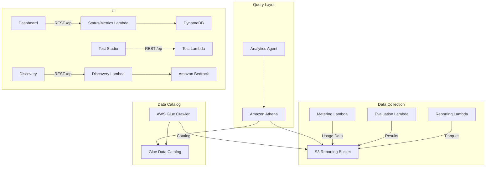

# Reporting & Analytics — Threat Analysis

## Document Information

| Field | Value |
|-------|-------|
| **Document Version** | 3.0 |
| **Last Updated** | 2026-07-28 |
| **Applies to release** | v0.6.3 |
| **Feature** | Reporting Database, Analytics, Evaluation |
| **Classification** | Internal |

## 1. Feature Overview

The reporting and analytics subsystem provides:
- **Reporting Database**: Document processing results written as Parquet files to S3, cataloged by AWS Glue, and queryable via Amazon Athena
- **Evaluation Framework**: Automated accuracy comparison against ground truth documents, with enhanced reporting and metrics
- **Cost Calculator**: Token-based cost estimation for processing operations
- **Dashboard Metrics**: Processing volume, success rates, costs, and performance metrics displayed in the Web UI
- **Test Studio**: Interactive document testing with real-time feedback
- **Discovery**: AI-assisted configuration generation from sample document analysis

## 2. Architecture

## 3. Threat Analysis

### RPT.T01: Reporting Data Tampering

| Attribute | Value |
|-----------|-------|
| **Threat ID** | RPT.T01 |
| **Category** | STRIDE: Tampering, Repudiation |
| **Description** | Parquet files in the reporting S3 bucket could be modified or deleted, altering historical processing records and analytics |
| **Attack Vector** | Direct S3 access with compromised credentials, or Lambda bug that overwrites existing reporting data |
| **Impact** | Corrupted analytics, unreliable evaluation metrics, loss of audit trail |
| **Likelihood** | Low |
| **Severity** | Medium |
| **Affected Components** | S3 Reporting Bucket, Parquet files |
| **Mitigations** | S3 versioning, write-only IAM policies for reporting Lambdas (no delete/overwrite), S3 Object Lock for critical records, CloudTrail logging of S3 operations |

### RPT.T02: Athena Query Data Exposure

| Attribute | Value |
|-----------|-------|
| **Threat ID** | RPT.T02 |
| **Category** | STRIDE: Information Disclosure |
| **Description** | Athena queries over reporting data expose all processed document information. Query results stored in Athena output location could be accessed by unauthorized users |
| **Attack Vector** | Access Athena query results S3 bucket, or submit queries that extract sensitive fields from processed documents |
| **Impact** | Exposure of all processed document data including extracted PII and business-sensitive information |
| **Likelihood** | Medium |
| **Severity** | High |
| **Affected Components** | Amazon Athena, S3 query results, Glue Data Catalog |
| **Mitigations** | Athena workgroup with restricted query result location, S3 lifecycle policies on query results (auto-delete), IAM restrictions on Athena access (Admin/Author only), Athena query logging |

### RPT.T03: Glue Catalog Manipulation

| Attribute | Value |
|-----------|-------|
| **Threat ID** | RPT.T03 |
| **Category** | STRIDE: Tampering |
| **Description** | The Glue Data Catalog defines table schemas and S3 data locations. If modified, Athena queries could read wrong data, miss data, or expose additional S3 paths |
| **Attack Vector** | Modify Glue table definitions to point to different S3 locations, or alter column definitions to expose additional data |
| **Impact** | Athena queries return wrong data, or expose data from other S3 paths |
| **Likelihood** | Low |
| **Severity** | Medium |
| **Affected Components** | AWS Glue Data Catalog, Glue Crawler |
| **Mitigations** | IAM restrictions on Glue API operations, Glue Catalog resource policies, CloudTrail logging of Glue operations, periodic catalog validation |

### RPT.T04: Evaluation Data Manipulation

| Attribute | Value |
|-----------|-------|
| **Threat ID** | RPT.T04 |
| **Category** | STRIDE: Tampering |
| **Description** | Ground truth data and evaluation results could be tampered with to hide accuracy degradation or mask the impact of attacks on processing quality |
| **Attack Vector** | Modify ground truth files in S3 to match incorrect extraction results, or tamper with evaluation metrics |
| **Impact** | False confidence in processing accuracy, masked detection of prompt injection or processing attacks |
| **Likelihood** | Low |
| **Severity** | High |
| **Affected Components** | S3 (ground truth and evaluation data), Evaluation Lambda |
| **Mitigations** | RBAC (Admin-only ground truth management), S3 versioning on ground truth data, evaluation result integrity checks, separate evaluation metrics storage |

### RPT.T05: Discovery Feature — Prompt Injection via Sample Documents

| Attribute | Value |
|-----------|-------|
| **Threat ID** | RPT.T05 |
| **Category** | STRIDE: Tampering, Elevation of Privilege |
| **Description** | The Discovery feature analyzes sample documents to auto-generate processing configurations. Adversarial sample documents could manipulate the AI into generating malicious configurations |
| **Attack Vector** | Upload crafted sample documents that contain prompt injection causing Discovery to generate configurations with malicious prompts, extraction schemas, or class definitions |
| **Impact** | Auto-generated configurations that systematically misprocess or exfiltrate data when used for production processing |
| **Likelihood** | Medium |
| **Severity** | High |
| **Affected Components** | Discovery Lambda, Amazon Bedrock, Configuration S3 |
| **Mitigations** | Discovery generates draft configs that require human review before activation, configuration schema validation, RBAC (Admin/Author required), evaluation testing before production use |

### RPT.T06: Test Studio — Uncontrolled Processing Costs

| Attribute | Value |
|-----------|-------|
| **Threat ID** | RPT.T06 |
| **Category** | STRIDE: Denial of Service |
| **Description** | Test Studio allows interactive document testing that invokes the full processing pipeline. Excessive testing could consume Bedrock tokens, Textract calls, and Lambda execution time |
| **Attack Vector** | Repeatedly submit documents through Test Studio to generate excessive processing costs |
| **Impact** | Cost escalation, processing resource exhaustion affecting production workloads |
| **Likelihood** | Medium |
| **Severity** | Medium |
| **Affected Components** | Test Studio, processing pipeline, Bedrock, Textract |
| **Mitigations** | RBAC (Admin/Author required for Test Studio), rate limiting on test submissions, separate test processing tracking, CloudWatch alarms on processing costs |

### RPT.T07: Ground-Truth Tampering via the Test Set Visual Editor

| Attribute | Value |
|-----------|-------|
| **Threat ID** | RPT.T07 |
| **Category** | STRIDE: Tampering, Repudiation |
| **Description** | Test Studio's **Edit Ground Truth** visual editor (v0.6.2) writes directly back to a test set's `baseline/.../result.json`. Ground truth is the measuring instrument for accuracy: an attacker who edits baselines to match current (possibly degraded or malicious) model output makes evaluation report high accuracy regardless of real quality — silently disabling the control that RPT.T04 and PM.T03/PM.T07 rely on to detect misprocessing and example poisoning. Because the harm is to *future* measurements rather than to visible data, it is unlikely to be noticed. |
| **Attack Vector** | An Author (or a compromised Author/Admin session — including via a feature UI bundle, FEAT.T01) edits baseline `inference_result` values so a poisoned configuration or biased few-shot set still scores as accurate. |
| **Impact** | Loss of trust in all accuracy metrics; conceals systematic misprocessing, prompt injection effects, and few-shot poisoning; corrupted evaluation history. |
| **Likelihood** | Low |
| **Severity** | High |
| **Affected Components** | `test_set_resolver` (`getTestSetDocuments`), test-set baseline objects in TestSetBucket, evaluation framework |
| **Mitigations** | Edits require the **Admin/Author** group, enforced server-side (`getTestSetDocuments` is Admin/Author; other roles are read-only in the editor). Every save writes an **`_editHistory` provenance entry** to the baseline, so a modification is attributable and reviewable rather than anonymous — the key anti-repudiation control here. TestSetBucket CORS permits only GET/HEAD + ranged reads for the browser's presigned fetches, so the browser cannot write objects directly; writes go through the resolver. S3 versioning on the bucket retains prior baseline bytes for recovery. |
| **Residual risk** | `_editHistory` records that a change happened but nothing *alerts* on baseline mutation, and an Author is legitimately allowed to edit ground truth (that is the feature's purpose), so policy cannot distinguish correction from sabotage. Recommend (1) alerting/reporting on baseline edits for high-value test sets, and (2) treating unexplained accuracy improvements as a signal to diff `_editHistory`. |

### RPT.T08: Extended Data Retention via Document Version History

| Attribute | Value |
|-----------|-------|
| **Threat ID** | RPT.T08 |
| **Category** | STRIDE: Information Disclosure |
| **Description** | Document Versions (v0.6.0) retains **every** successful processing run as an immutable snapshot of pinned S3 object versions, where previously re-processing the same S3 key overwrote prior results. Content an operator believes was superseded — or removed by re-uploading a redacted replacement — remains readable through version history until `DataRetentionInDays` expires. This changes the deployment's data-retention profile in a way that matters for privacy/erasure obligations. |
| **Attack Vector** | A user with access to version history reads a prior run's results for content that was intentionally replaced (e.g. re-uploading a redacted document over an un-redacted one, expecting the original to be gone). Object bytes are fetched with an explicit `versionId` through `getFilePresignedUrl`. |
| **Impact** | Disclosure of superseded document content and extracted data, including data an operator intended to remove; retention beyond what a naive "delete and re-upload" workflow implies. |
| **Likelihood** | Low |
| **Severity** | Medium |
| **Affected Components** | `document_versions_resolver`, versioned S3 output objects, run manifests, `getFilePresignedUrl` |
| **Mitigations** | Snapshots are bounded by **`DataRetentionInDays`**, so retention is finite and operator-configurable rather than indefinite. `deleteDocumentVersion` is **Admin-only** (server-side enforced), giving an explicit purge path for a specific run. The feature is documented, and the UI surfaces a Version History panel so retained versions are **visible** rather than hidden state. |
| **Residual risk** | `listDocumentVersions` is available to **any authenticated user**, and version bytes are read via `getFilePresignedUrl`, which is bucket-scoped but **not key-scoped** (see UI.T06) — so version history widens the practical impact of UI.T06 by giving any authenticated user an enumerable index of object keys *and* version ids. Recommend closing UI.T06 and considering whether `listDocumentVersions` should be scoped to users who can see the underlying document. For redaction workflows, prefer the PII feature's *redact copy and stop* mode (which deletes the original) over manual replace-and-reupload. |

## 4. Security Controls Summary

| Control | Implementation | Threats Mitigated |
|---------|---------------|-------------------|
| **S3 versioning** | Versioning on reporting and ground truth buckets | RPT.T01, RPT.T04, RPT.T07 |
| **Write-only IAM** | Reporting Lambda can write but not delete Parquet files | RPT.T01 |
| **Athena workgroup** | Restricted query result location, IAM scoping | RPT.T02 |
| **IAM restrictions** | Glue API access restricted to platform roles | RPT.T03 |
| **RBAC** | Role-based access to evaluation, discovery, test studio, ground-truth editing | RPT.T04, RPT.T05, RPT.T06, RPT.T07 |
| **Edit provenance** | `_editHistory` entry written on every ground-truth save | RPT.T07 |
| **Read-only CORS on TestSetBucket** | GET/HEAD + ranged reads only; writes must go through the resolver | RPT.T07 |
| **Admin-only version delete** | `deleteDocumentVersion` restricted to Admin | RPT.T08 |
| **Bounded retention** | Document versions retained for `DataRetentionInDays` | RPT.T08 |
| **Config validation** | Schema validation of discovery-generated configs | RPT.T05 |
| **Rate limiting** | Test Studio submission limits | RPT.T06 |
| **Audit logging** | CloudTrail for S3, Glue, Athena operations | All |

## 5. Open Items

| Item | Threat | Status |
|------|--------|--------|
| No alerting on ground-truth baseline mutation | RPT.T07 | **Open** — `_editHistory` is recorded but not surfaced/alerted |
| `listDocumentVersions` readable by any authenticated user | RPT.T08 | **Open** — combines with UI.T06 to widen key/version enumeration |
| Version history retains superseded content until retention expiry | RPT.T08 | **Accepted, documented** — use *redact copy and stop* for erasure workflows |
