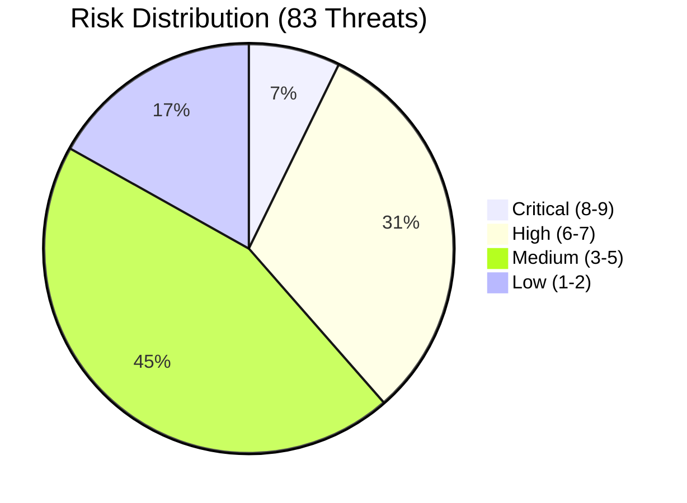

# Risk Assessment Matrix

## Document Information

| Field | Value |
|-------|-------|
| **Document Version** | 3.0 |
| **Last Updated** | 2026-07-28 |
| **Applies to release** | v0.6.3 |
| **Classification** | Internal |
| **Total Threats Identified** | 83 |

## 1. Risk Scoring Methodology

### Likelihood Scale

| Rating | Score | Description |
|--------|-------|-------------|
| **Low** | 1 | Requires specialized skills, insider access, or unlikely conditions |
| **Medium** | 2 | Feasible with moderate effort by authenticated users or sophisticated attackers |
| **High** | 3 | Readily exploitable with common tools or by any authenticated user |

### Severity Scale

| Rating | Score | Description |
|--------|-------|-------------|
| **Low** | 1 | Minimal impact, cosmetic or informational |
| **Medium** | 2 | Moderate impact on confidentiality, integrity, or availability for limited scope |
| **High** | 3 | Significant impact on confidentiality, integrity, or availability |
| **Critical** | 4 | Severe impact: complete data breach, system compromise, or total service loss |

### Risk Score

**Risk = Likelihood × Severity**

| Risk Score | Risk Level | Action Required |
|------------|-----------|-----------------|
| 1-2 | **Low** | Accept or monitor |
| 3-4 | **Medium** | Mitigate with standard controls |
| 6 | **High** | Prioritize mitigation |
| 8-9 | **Very High** | Immediate mitigation required |
| 12 | **Critical** | Block deployment until mitigated |

## 2. Complete Risk Register

> Generated from [`deliverables/threat-model.tc.json`](../deliverables/threat-model.tc.json)
> by [`scripts/build_threat_model.py`](../scripts/build_threat_model.py). Regenerate
> after adding a threat rather than editing this table by hand.

### Critical Risk (Score 8–9)

| Threat ID | Threat | Risk | Component | Status |
|-----------|--------|------|-----------|--------|
| CHAT.T01 | Prompt Injection via Chat Messages | **9** | Companion Chat | Mitigated |
| PM.T01 | Prompt Injection via Document Content | **9** | Pipeline Mode | Mitigated |
| FEAT.T01 | Feature UI Bundle Executes Unsandboxed in the Host Origin | **8** | Feature Platform | Partially Mitigated |
| HOOK.T02 | Data Exfiltration via Post-Processing Hook | **8** | Lambda Hooks | Partially Mitigated |
| MCP.T01 | Data Exfiltration via MCP Tools | **8** | MCP Integration | Partially Mitigated |
| PM.T06 | Configuration Tampering | **8** | Pipeline Mode | Mitigated |

### High Risk (Score 6–7)

| Threat ID | Threat | Risk | Component | Status |
|-----------|--------|------|-----------|--------|
| AGT.T01 | SQL Injection via Natural Language | **6** | Agent Analysis | Mitigated |
| AGT.T05 | Cross-User Data Leakage via Athena | **6** | Agent Analysis | Mitigated |
| AUTH.T02 | JWT Token Theft/Replay | **6** | Authentication/RBAC | Mitigated |
| AUTH.T03 | Insufficient Authorization Granularity | **6** | Authentication/RBAC | Mitigated |
| AUTH.T07 | Config-Version Scope Bypass (Fail-Open Scope Lookup) | **6** | Authentication/RBAC | Mitigated |
| AUTH.T08 | Silently-Ignored Schema Authorization Directives | **6** | Authentication/RBAC | Mitigated |
| AUTH.T09 | Insecure Direct Object Reference (IDOR / BOLA) | **6** | Authentication/RBAC | Mitigated |
| CHAT.T03 | Chat Streaming Function URL — Missing Group and Session-Ownership Enforcement | **6** | Companion Chat | **Open** |
| FEAT.T03 | Feature Stack IAM Privilege and Host Resource Access | **6** | Feature Platform | Partially Mitigated |
| HOOK.T06 | Preprocessing Hook Operates on the Raw Source Document and Can Halt or Replace It | **6** | Lambda Hooks | Mitigated |
| JOB.T01 | Jobs API Clients Bypass the Cognito Group RBAC Model | **6** | Jobs API | Mitigated |
| KB.T01 | Knowledge Base Poisoning | **6** | Knowledge Base | Mitigated |
| KB.T02 | RAG Context Injection | **6** | Knowledge Base | Partially Mitigated |
| MCP.T03 | MCP Response Injection | **6** | MCP Integration | Partially Mitigated |
| MCP.T04 | Unauthorized External Service Access | **6** | MCP Integration | Mitigated |
| PII.T03 | Redaction Bypass — Un-Redacted Document Processed on Hook Failure | **6** | PII Anonymization | Mitigated |
| PII.T04 | Redaction Mapping Table as a Re-Identification Oracle | **6** | PII Anonymization | Mitigated |
| PM.T03 | Model Output Manipulation | **6** | Pipeline Mode | Mitigated |
| RPT.T02 | Athena Query Data Exposure | **6** | Reporting/Analytics | Mitigated |
| RPT.T05 | Discovery Feature — Prompt Injection via Sample Documents | **6** | Reporting/Analytics | Mitigated |
| RPT.T07 | Ground-Truth Tampering via the Test Set Visual Editor | **6** | Reporting/Analytics | Partially Mitigated |
| SDK.T01 | Credential Exposure on Developer Machines | **6** | SDK/CLI | Partially Mitigated |
| SDK.T02 | Insecure Automation Pipelines | **6** | SDK/CLI | Partially Mitigated |
| UI.T01 | Cross-Site Scripting (XSS) | **6** | Web UI | Partially Mitigated |
| UI.T03 | UI API Abuse (REST dispatcher) | **6** | Web UI | Mitigated |
| UI.T06 | Presigned Read URLs Are Bucket-Scoped, Not Key-Scoped | **6** | Web UI | **Open** |

### Medium Risk (Score 3–5)

| Threat ID | Threat | Risk | Component | Status |
|-----------|--------|------|-----------|--------|
| AGT.T02 | Arbitrary Code Execution via AgentCore | **4** | Agent Analysis | Mitigated |
| AGT.T03 | Agent Routing Manipulation | **4** | Agent Analysis | Mitigated |
| AUTH.T01 | Privilege Escalation via Group Manipulation | **4** | Authentication/RBAC | Mitigated |
| BDA.T01 | BDA Service Opacity | **4** | BDA Mode | Partially Mitigated |
| BDA.T04 | BDA Service Availability | **4** | BDA Mode | Mitigated |
| CHAT.T05 | Streaming Response Denial of Service | **4** | Companion Chat | Partially Mitigated |
| HOOK.T01 | Malicious Customer Code Execution | **4** | Lambda Hooks | Partially Mitigated |
| HOOK.T04 | Hook Lambda Timeout/Failure Cascade | **4** | Lambda Hooks | Mitigated |
| MCP.T05 | External MCP Client Abuse | **4** | MCP Integration | Mitigated |
| PII.T01 | Un-Redacted Document Content Reaches the Detection Model | **4** | PII Anonymization | Accepted |
| PM.T02 | OCR Manipulation / Adversarial Documents | **4** | Pipeline Mode | Mitigated |
| PM.T05 | Textract Service Dependency | **4** | Pipeline Mode | Mitigated |
| PM.T08 | Document Content Sent to a Non-Anthropic Model Family (OpenAI via `bedrock-mantle`) | **4** | Pipeline Mode | Partially Mitigated |
| RPT.T06 | Test Studio — Uncontrolled Processing Costs | **4** | Reporting/Analytics | Mitigated |
| SDK.T04 | Batch Processing Abuse | **4** | SDK/CLI | Mitigated |
| AUTH.T04 | Cognito User Pool Misconfiguration | **3** | Authentication/RBAC | Mitigated |
| AUTH.T05 | Refresh Token Abuse | **3** | Authentication/RBAC | Mitigated |
| AUTH.T10 | Token Lifecycle — Post-Logout Token Reuse (Stateless JWT) | **3** | Authentication/RBAC | Accepted |
| AUTH.T11 | Weak Transport Security (TLS downgrade / cleartext) | **3** | Authentication/RBAC | Mitigated |
| AUTH.T12 | Missing Input-Shape Validation (Type Confusion via Lost Schema Validation) | **3** | Authentication/RBAC | Mitigated |
| BDA.T03 | BDA Project Configuration Tampering | **3** | BDA Mode | Mitigated |
| CHAT.T02 | Conversation Session Hijacking | **3** | Companion Chat | Mitigated |
| CHAT.T04 | Conversation History Data Exposure | **3** | Companion Chat | Mitigated |
| CHAT.T06 | Client-Supplied Caller Identity on the Agent Streaming Route | **3** | Companion Chat | **Open** |
| FEAT.T04 | Stale or Downgraded Feature Bundle Served to Users | **3** | Feature Platform | Partially Mitigated |
| HOOK.T03 | Inference Hook Result Tampering | **3** | Lambda Hooks | Mitigated |
| HOOK.T05 | Privilege Escalation via Hook IAM Role | **3** | Lambda Hooks | Mitigated |
| JOB.T02 | Jobs API Is Outside the Automated Authorization Test Harness | **3** | Jobs API | **Open** |
| JOB.T03 | Static Client Secret with No Rotation Mechanism | **3** | Jobs API | Partially Mitigated |
| MCP.T02 | Malicious Tool Injection | **3** | MCP Integration | Mitigated |
| PII.T02 | Redaction Loop / Re-Entrancy via Input-Bucket Writeback | **3** | PII Anonymization | Partially Mitigated |
| PII.T05 | Companion Config-Version Pairing Misconfiguration | **3** | PII Anonymization | Partially Mitigated |
| PM.T04 | Cross-Step Data Poisoning | **3** | Pipeline Mode | Mitigated |
| RPT.T04 | Evaluation Data Manipulation | **3** | Reporting/Analytics | Mitigated |
| RPT.T08 | Extended Data Retention via Document Version History | **3** | Reporting/Analytics | Partially Mitigated |
| SDK.T03 | SDK Supply Chain Attack | **3** | SDK/CLI | Mitigated |
| UI.T07 | Security-Header and CSP Divergence Between Hosting Modes | **3** | Web UI | **Open** |

### Low Risk (Score 1–2)

| Threat ID | Threat | Risk | Component | Status |
|-----------|--------|------|-----------|--------|
| AGT.T04 | Conversation History Poisoning | **2** | Agent Analysis | Mitigated |
| AUTH.T06 | Cross-Tenant Data Access (Multi-Stack) | **2** | Authentication/RBAC | Mitigated |
| BDA.T02 | BDA Output Format Mapping Errors | **2** | BDA Mode | Mitigated |
| BDA.T05 | S3 Cross-Access via BDA | **2** | BDA Mode | Mitigated |
| FEAT.T02 | Feature Registry Enumeration by Any Authenticated User | **2** | Feature Platform | Accepted |
| KB.T03 | OpenSearch Serverless Data Exposure | **2** | Knowledge Base | Mitigated |
| KB.T04 | Excessive RAG Retrieval | **2** | Knowledge Base | Mitigated |
| MCP.T06 | AgentCore Gateway Lifecycle Attacks | **2** | MCP Integration | Mitigated |
| PM.T07 | Few-Shot Example Poisoning | **2** | Pipeline Mode | Mitigated |
| RPT.T01 | Reporting Data Tampering | **2** | Reporting/Analytics | Mitigated |
| RPT.T03 | Glue Catalog Manipulation | **2** | Reporting/Analytics | Mitigated |
| UI.T02 | Presigned Upload URL Abuse | **2** | Web UI | Mitigated |
| UI.T04 | Hosting Origin Misconfiguration | **2** | Web UI | Mitigated |
| UI.T05 | Client-Side Configuration Exposure | **2** | Web UI | Mitigated |

## 3. Risk Distribution Summary

### By Component

| Component | Critical | High | Medium | Low | Total |
|-----------|----------|------|--------|-----|-------|
| Agent Analysis | 0 | 2 | 2 | 1 | 5 |
| Authentication/RBAC | 0 | 5 | 6 | 1 | 12 |
| BDA Mode | 0 | 0 | 3 | 2 | 5 |
| Companion Chat | 1 | 1 | 4 | 0 | 6 |
| Feature Platform | 1 | 1 | 1 | 1 | 4 |
| Jobs API | 0 | 1 | 2 | 0 | 3 |
| Knowledge Base | 0 | 2 | 0 | 2 | 4 |
| Lambda Hooks | 1 | 1 | 4 | 0 | 6 |
| MCP Integration | 1 | 2 | 2 | 1 | 6 |
| PII Anonymization | 0 | 2 | 3 | 0 | 5 |
| Pipeline Mode | 2 | 1 | 4 | 1 | 8 |
| Reporting/Analytics | 0 | 3 | 3 | 2 | 8 |
| SDK/CLI | 0 | 2 | 2 | 0 | 4 |
| Web UI | 0 | 3 | 1 | 3 | 7 |
| **Total** | **6** | **26** | **37** | **14** | **83** |

### By STRIDE Category

| STRIDE Category | Threats | Highest Risk |
|----------------|---------|--------------|
| **Spoofing** | 11 | High |
| **Tampering** | 36 | Critical |
| **Repudiation** | 3 | High |
| **Information Disclosure** | 35 | Critical |
| **Denial of Service** | 14 | High |
| **Elevation of Privilege** | 25 | Critical |

### Mitigation Status

| Status | Count | Description |
|--------|-------|-------------|
| **Mitigated** | 56 | Controls implemented and verified |
| **Partially Mitigated** | 19 | Some controls in place, additional measures recommended |
| **Open** | 5 | **Real gap with no effective control today — see the open-items list below** |
| **Accepted** | 3 | Risk accepted with documented rationale |

#### Open items (no effective control today)

| Threat ID | Threat | Component |
|-----------|--------|-----------|
| CHAT.T03 | Chat Streaming Function URL — Missing Group and Session-Ownership Enforcement | Companion Chat |
| CHAT.T06 | Client-Supplied Caller Identity on the Agent Streaming Route | Companion Chat |
| JOB.T02 | Jobs API Is Outside the Automated Authorization Test Harness | Jobs API |
| UI.T06 | Presigned Read URLs Are Bucket-Scoped, Not Key-Scoped | Web UI |
| UI.T07 | Security-Header and CSP Divergence Between Hosting Modes | Web UI |

## 4. Top Priority Threats

Ranked by risk score, then by how much work remains (Open → Partially Mitigated → Mitigated):

| Priority | Threat ID | Description | Risk Score | Status |
|----------|-----------|-------------|------------|--------|
| 1 | CHAT.T01 | Prompt Injection via Chat Messages | 9 | Mitigated |
| 2 | PM.T01 | Prompt Injection via Document Content | 9 | Mitigated |
| 3 | FEAT.T01 | Feature UI Bundle Executes Unsandboxed in the Host Origin | 8 | Partially Mitigated |
| 4 | HOOK.T02 | Data Exfiltration via Post-Processing Hook | 8 | Partially Mitigated |
| 5 | MCP.T01 | Data Exfiltration via MCP Tools | 8 | Partially Mitigated |
| 6 | PM.T06 | Configuration Tampering | 8 | Mitigated |
| 7 | CHAT.T03 | Chat Streaming Function URL — Missing Group and Session-Ownership Enforcement | 6 | **Open** |
| 8 | UI.T06 | Presigned Read URLs Are Bucket-Scoped, Not Key-Scoped | 6 | **Open** |
| 9 | FEAT.T03 | Feature Stack IAM Privilege and Host Resource Access | 6 | Partially Mitigated |
| 10 | KB.T02 | RAG Context Injection | 6 | Partially Mitigated |
| 11 | MCP.T03 | MCP Response Injection | 6 | Partially Mitigated |
| 12 | RPT.T07 | Ground-Truth Tampering via the Test Set Visual Editor | 6 | Partially Mitigated |

## 5. Recommendations

### Immediate Actions — Open gaps (no effective control today)

These are code/config changes, not documentation work, and are ordered by
effort-to-value:

1. **Chat streaming authorization (CHAT.T03 + CHAT.T06)** — enforce session
   ownership in both vendored streaming processors (reuse the existing
   `ownerSub`-vs-`caller_sub` comparison before loading memory) and enforce the
   Admin/Author/Viewer group on `/chat/agent`. **Fix CHAT.T06 first or together**:
   `/chat/agent` currently prefers a client-supplied `callerSub` over the SigV4
   identity, which would silently neuter an ownership check that reads it.
   Then extend the automated harness to cover this transport — today
   `make api-test` drives `POST /op/{field}` only, so a regression here is
   undetectable.
2. **Presigned read key scoping (UI.T06)** — derive the permitted key prefix
   from the caller's identity/scope instead of trusting the supplied `s3Uri`,
   and make the bucket allow-list fail **closed** when its env vars are unset.
   This is a prerequisite for `allowedConfigVersions` to be a real boundary, and
   it also bounds RPT.T08 and PII.T05.
3. **CSP in APIGateway hosting mode (UI.T07)** — add a static
   `Content-Security-Policy` header to `WebUIRootMethod`/`WebUIProxyMethod`,
   matching the other four security headers already set there. Cheap; closes a
   gap that lands specifically in GovCloud/private deployments.
4. **Jobs API scope-negative test (JOB.T02)** — add a `jobs.read`-only-token
   write attempt and an unauthenticated request to the Jobs API stack test, so
   the gate asymmetry with the UI API closes.

### Next Actions (Critical/High Risk, Partially Mitigated)

1. **Feature bundle integrity (FEAT.T01, FEAT.T04)**: record a SHA-384 digest of
   each `ui-bundle.js` at install time and set `script.integrity` in
   `FeatureLoader` — the single highest-value hardening for the Feature Platform,
   converting silent bundle substitution into a blocked load
2. **MCP Data Exfiltration (MCP.T01)**: Implement VPC egress controls for MCP Lambda functions; establish MCP agent security review process
3. **Post-Processing Hook Exfiltration (HOOK.T02)**: Document customer-side VPC and egress control requirements; provide reference architecture for secure hook deployment
4. **SDK Credential Management (SDK.T01, SDK.T02)**: Implement credential helper integration; provide secure automation pipeline templates
5. **Hook IAM Scoping (HOOK.T05, MCP.T04)**: Publish IAM role templates for hook Lambdas with least-privilege configurations
6. **XSS defense-in-depth (UI.T01)**: complete the Monaco editor compatibility
   work so `'unsafe-inline'`/`'unsafe-eval'` can be dropped from `script-src`,
   and narrow `script-src`'s `https:` to `'self'` (Talos #12 phase 2)
7. **Ground-truth change visibility (RPT.T07)**: surface/alert on baseline
   `_editHistory` mutations for high-value test sets

### Ongoing Monitoring

1. **Prompt Injection Detection**: Monitor evaluation metrics for accuracy degradation that may indicate ongoing prompt injection attacks
2. **Authorization Audit**: Periodic review of resolver-Lambda authorization checks for completeness — automated by `make api-test-static` (drift + missing-check scan) and `make api-test` (live op×role matrix)
3. **Athena Query Monitoring**: Alert on unusual query patterns or data volumes
4. **Agent Usage Monitoring**: Track agent tool invocation patterns for anomalies
